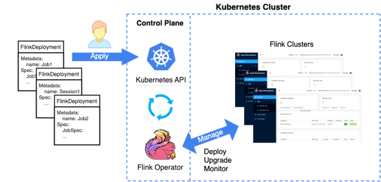
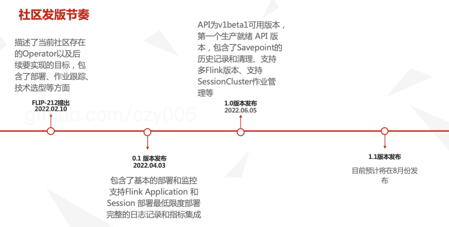
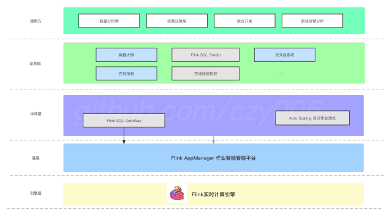
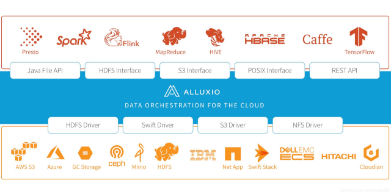

<a name="PkLJh"></a>
# 简介
陈政羽，Flink中文社区志愿者，Flink K8S Operator Contributor & Flink Web Contributor<br />目前在真有趣大数据平台开发工程师，从0到1为真有趣构建部署、监控、运维一站式云原生的大数据实时计算平台，今天给大家带来的分享是Flink K8s Operator 相关解析和实践。首先先会简单介绍一下当前社区Operator相关情况和发版节奏以及相关功能；于此同时对比社区版本真有趣在内部构建的Operator功能和特色，以及后续公司需要继续迭代的方向和社区未来的RoadMap。
<a name="NwN4P"></a>
# Flink K8s Operator 简介 & 社区情况
Flink Kubernetes Operator 旨在承担管理 Flink 部署的用户职责，用户对 Flink 部署应该如何表现、如何启动集群、如何部署作业、如何升级它们以及在出现问题时如何做出调整必须有着深入的了解。Flink Operator主要目标是使得这些流程自动化，在当前单纯靠 Flink 原生集成是无法实现的。整体流程如下图

<br />

```
apiVersion: flink.apache.org/v1beta1
kind: FlinkDeployment
metadata:
  namespace: default
  name: basic-example
spec:
  image: flink:1.15
  flinkVersion: v1_15
  flinkConfiguration:
    taskmanager.numberOfTaskSlots: "2"
  serviceAccount: flink
  jobManager:
    resource:
      memory: "2048m"
      cpu: 1
  taskManager:
    resource:
      memory: "2048m"
      cpu: 1
  job:
    jarURI: local:///opt/flink/examples/streaming/StateMachineExample.jar
    parallelism: 2
    upgradeMode: stateless
    state: running
```
用户通过自定义配置，搭配恢复策略（STATELESS）修改作业参数无需人工干预即可完成作业自动重启恢复部署，极大的简化了用户部署成本。<br />Flink K8S Operator 作为一个新生的婴儿，在此之前社区已经有其他的Flink Operaotr，其中不乏Google、Lyft等开源的，那么为什么社区还要再做一个呢？社区其实主要从中立性、云原生、用户角度等方面去考虑。从中立性的角度出发，这些第三方Operator项目不在ASF等中立基金或者开源社区下。因此往往缺乏更广泛的社区参与和讨论，如果在维护者离职或者关注重心不在这里时候，就会容易项目会停止更新；从云原生的角度出发，Operator 改变传统的服务器部署模式，用户只需通过Helm的方式一键部署在K8S集群上，通过用户自定义资源和K8S Crd 模式提供给使用方快速部署一个Flink程序的能力；从用户角度而言，用户可以通过Operator进行全生命周期的Flink云原生体验，通过kubectl等k8s工具管理Flink应用程序及其生命周期。用户无需关心部署细节，通过Operator即可实现自动化部署作业，暂停作业，水平扩容等功能。<br />社区目前保持了较快的发版节奏，平均2个月向前发布一个版本，并且从1.0版本开始保证其功能向后兼容<br />
<br />

# Flink K8s Operator 功能介绍
Flink K8s Operator 在6月初发布了里程碑1.0版本，意味着用户可以使用其应用生产，其中1.0包含了以下功能

- 保存点历史记录和清理：清理基于时间或者Savepoint最大数量进行清理
- 多版本支持：同时支持Flink1.13、1.14、1.15版本
- 作业部署恢复和回滚：作业在发生致命错误时候，可以回滚到上一个正常使用的作业逻辑版本
- Session Cluster 作业管理初步支持：初步支持了SessionCluster Job 定义与部署

由以上功能组成了1.0的新版本，当然也还包括各种bug fixed，欢迎各位前去体验。目前Flink K8S Operator整体运作流程是十分简洁的（如下图），用户通过自定义资源定义出Flink作业所需要的资源，然乎通过Operator不断部署调整至用户所期望的部署状态，并且通过RestApi追踪其部署情况，并将内部追踪的信息以事件或者状态的形式暴露给用户进行判断。

<br />

目前无论是Application Mode 还是 Session 做的部署，他们的状态扭转都如下流程<br />

<br />

作业部署后，状态会为DEPLOYING，当作业部署上去但是并没有完成部署完成时候状态时DEPLOYED_NOT_READY，当部署错误时候会变为ERROR；当部署完成时候状态会扭转至READY，在READY状态时候会不断通过RESTAPI获取当前作业相关信息，如果作业丢失后状态会扭住为MISSING触发重新部署机制，如果发生错误则扭转至ERROR，用户需要手动处理相关问题。<br />目前1.0版本已经支持了SessionCluster Job方式部署，可以通过以下方式进行定义
```
apiVersion: flink.apache.org/v1beta1
kind: FlinkSessionJob
metadata:
  name: basic-session-job-example
spec:
  deploymentName: basic-session-cluster
  job:
    jarURI: https://repo1.maven.org/maven2/org/apache/flink/flink-examples-streaming_2.12/1.15.0/flink-examples-streaming_2.12-1.15.0-TopSpeedWindowing.jar
    parallelism: 4
    upgradeMode: stateless
```
通过这种方式运行SessionCluster目前还有一定的局限性

- 当前Session Cluster Job 社区版本不支持 LastState Upgrade Mode
- 每次部署/销毁 Session作业需要销毁集群，这一部分暂无高级抽象
- 利用Flink文件系统机制来下载 jar 并提交到会话集群。因此 FlinkSessionJob 必须与由 FlinkDeployment 管理的现有Session集群一起运行

社区目前正在基于 _FLIP-225：Implement standalone mode support in the kubernetes operator_ 进行开发这部分功能，后续会继续完善SessionCluster Job这一部分的抽象。
<a name="FkSHD"></a>
# Flink云原生在真有趣的实践
为什么真有趣需要研发自己的Flink Operator，主要有几下以点公司层面的原因：

- 社区当时 Operator 项目未立项，以及其他开源的同类竞品都是基于 Go 实现，且版本较老和维护频率低，无法满足实际生产需求
- 公司云原生使用和运维积累经验丰富，目前 K8S 已经在游戏服务端大规模部署和应用，希望这部分能力在大数据领域继续深耕和扩展
- 使用云原生技术节省运维和部署成本（核心需求）。当前社区的Operator 无法满足生产上多版本、自定义资源描述、LAST_STATE作业恢复、作业历史、SessionCluster 集群管理等高级功能需求，故需要自己再次封装
- 社区当前 Operator 没有可视化界面，首次使用Flink SQL和Flink的用户体验和学习成本较高，期望借助平台封装减少其对Flink专业名词的了解
<a name="eO7KR"></a>
## 游戏行业Flink业务场景
在**游戏行业**中，我们也可以汇总为以下几类数据需求痛点，这也是为什么我们需要Flink的原因

- 实时数据大屏：统计用户数据大屏展示给决策经营层以及相关决策人员，让其知晓游戏当前生命周期以及运营情况
- 反外挂业务：通过订阅相关用户事件以及环境状态和相关游戏参数，判断用户是否使用非法外挂软件或者恶意手段修改游戏数据。本者用户第一的角度，有效维护玩家游戏体验和创造者，提升用户留存率和游戏体验（公司核心主业务，特别针对 FPS 射击类游戏）
- 数据清洗业务：通过实时接入消息中间件清洗数据，输出至不同的数据源（如Clickhouse、Hive）等大数据查询引擎，提供给数据人员查询数据
- 数据同步业务：通过 Flink CDC 可以接入数据库同步，同步相关玩家数据、玩家日志等信息到数据仓库进行离线或者交互式分析
- AI预测：通过 Alink 释放实时计算 AI 计算，预测游戏行业的买量投放、广告投放等业务

在真有趣内部，我们主要使用反外挂业务服务于我们的游戏香肠派对，为游戏营造良好的竞技环境；其次还有部分数据同步管道工作，用于同步游戏数据服务的CDC工具。按照业务领域划分，我们可以产出这样一幅全景游戏行业的业务图（适合使用大部分场景）
<br />
## 作业状态恢复功能
作业状态恢复在真有趣主要有以下这几种场景：

- 业务需求方期望每日定时保存 SavePoint ，避免作业在意外时候，由于使用较老的状态进行恢复导致业务恢复时间过长和重新消费浪费资源
- 业务方需要经常修改不同的反外挂参数，期望作业重启时候无需人为干预，能过基于恢复策略自动重启恢复作业，并且使用最新的保存点（Savepoint）或者检查点（Checkpoint）进行恢复。
- 希望恢复作业时候无需关注是 Savepoint 还是 Checkpoint 这些概念，屏蔽数据分析师、运营等业务方对于底层专业名词的了解。

基于上面的场景，我们设计了三种 **_恢复机制_** 

- LATEST_STATE：基于最后状态的恢复，包含了Savepoint和Checkpoint进行恢复，目前在公司内部版本1.14基于K8S Configmap 实现了平台侧管理Snapshot，1.15正在和社区 _Flink-26930 _推进此issuse实现，所以标注为实验性功能
- LATEST_SAVE_POINT：使用平台侧已知的最后的检查点进行恢复，如果有多个检查点，则按照检查点的实际完成时间进行排序，优先选择最新的检查点
- NONE：使用空状态恢复（针对无状态的应用）

通过上面三种策略能够满足我们生产大部分的所需的业务场景。社区目前也有类似的策略名词，其实都是一样的，具体大家可以看看官方文档，这里就不做详细阐述。<br />备注：_社区目前正在推进 [Flink-26930] Rethink last-state upgrade implementation in flink-kubernetes-operator_
<a name="IbvGB"></a>
## Session Cluster 状态机
社区目前正在推进的FLIP-212：Support Session Cluster Job，在真有趣内部，为了能够解放运维部署Flink集群和作业的流程，简化工作，我们研发了基于K8S观察机制的一个状态扭转机，其中主要有2大状态

- 期状状态：用户所期望的值，状态机将尽最大努力扭转至此状态
- 当前状态：抽象出当前内部运行状态，暴露给用户了解当前运行状况

其中期望状态是由用户选择的，用户可以自行选择，当用户改变其期望状态时，内部Operator将尽最大努力扭转到用户期望状态，我们设计了2种集群的期望状态

- RUNNING：期望当前集群是运行的状态
- CANCEL：期望当前集群停止的状态

用户基于这2种状态进行选择，当用户期望为RUNNING状态后，系统将暴露当前状态给用户观测，当前状态反馈了当前系统内部部署集群的一个实际状态，主要有以下几种

- STARTING：集群正在启动中，检查用户资源定义是否正确，验证Flink版本Git Commit Id，集群资源是否足够等流程，如果此流程不通过直接扭转为 FAIELD
- RUNNING：当前集群正在正常运行，使用Rest API 请求 Overview 以及判断集群JM Pod状态去综合判断出当前状态是否为正常运行
- PENDING_UPDATE：等待升级，用户修改TM数量时候触发。如果资源不足则会一直为此状态，并定时重新读取资源相关配置和检查资源状态，直至成功扭转至 
- UPDATING状态 为止UPDATING：由PENDING_UPDATE扭转至此状态，表示集群正在扩容/缩小 TM 数量
- FAIELD：集群部署失败时候触发，例如集群在启动过程中的检查中无法通过、集群运行中出现致命错误等都会扭转至此状态
- CANCEL：当前集群为无部署的卸载状态
<a name="cmCXA"></a>
## 存储方面
在底层存储方面，我们也做了许多调查和研究，最后我们选择Alluxio作为我们底层的一个数据编排和存储引擎的中间加速层<br />

<br />

我们主要有以下几点考虑：

- 业务期望屏蔽底层细节，无需关注底层存储系统是HDFS分布式存储 还是S3、OSS、COS等公有云存储，交由开发人员维护，统一上层文件访问接口
- 存储加速功能，冷热数据分离
- 流量费用节省，避免Checkpoint 频繁读写公用云存储产生较高的请求费和流量费
<a name="mxIbO"></a>
# <br />社区未来 & 公司后续规划
基于现有平台，我们后续还会围绕着社区和公司内部版本做出强化，吸收社区优秀设计。其中包括以下几点

- 参与社区贡献：Session Cluster 部署模式已经在公司内部成熟运行，希望基于 FLIP-225 进行扩展和参与到社区贡献
- Application Mode 迁移开发：部分稳定性要求较高的作业后续 Session Cluster 逐步迁移至 Flink Application Mode 模式
- 支持Flink SQL：Flink SQL 作业在 FLINK1.16 开始实验性的支持算子级别恢复，后续将调研此工作
- AutoScaling平台研发：作业自动调优功能（仅限 Application Mode 模式），基于流量和业务特点进行动态伸缩，节省 服务器成本

社区后续的RoadMap将会推进以下工作：

-  FLIP-225 ：支持Session Cluster Standalone 作业的部署和管理
- 基于Pod的水平自动伸缩相关工作
- 可插拔的状态管理和事件通知机制
- 改进Savepoint的管理和相关触发逻辑

目前社区的工作其实有一部分是和我所做的一些工作是有交互的，后续我们也会进行持续关注和做出贡献。视频回放在Apache Flink 官方公众号以及CSDN同步，欢迎各位前去观看。
