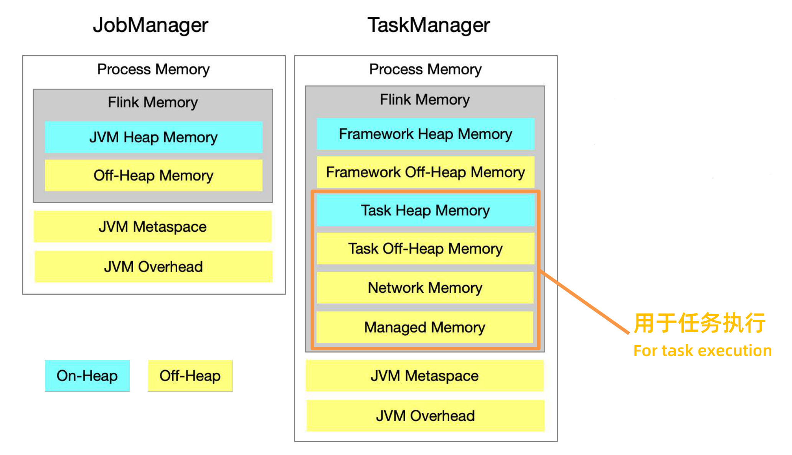
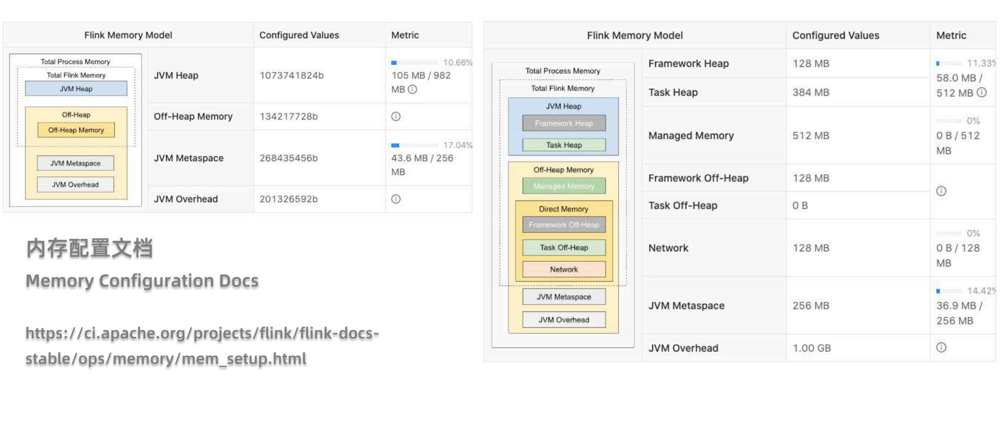
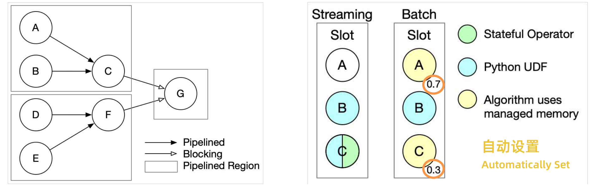
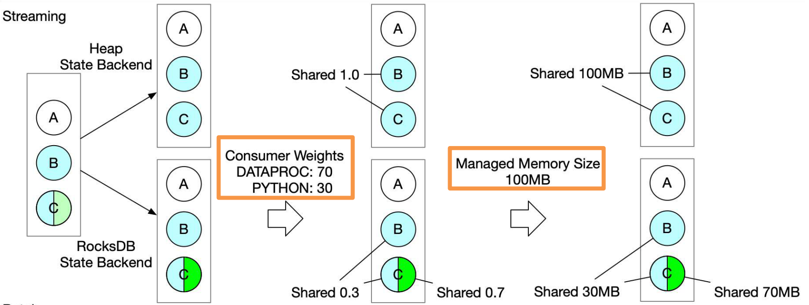
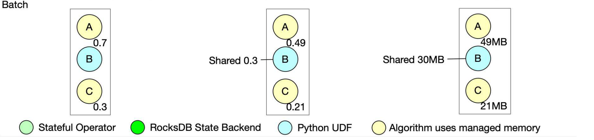
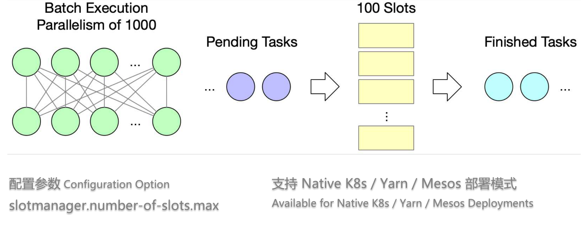
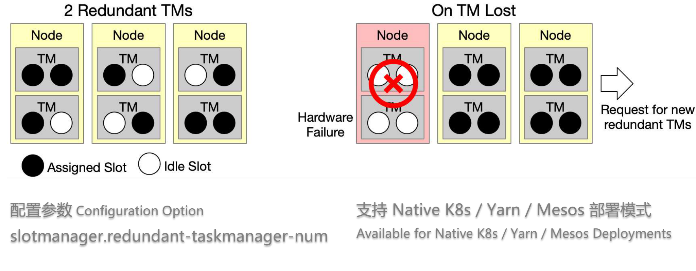
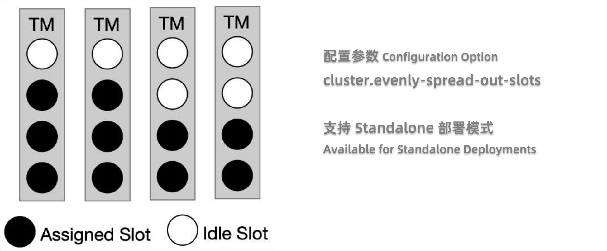
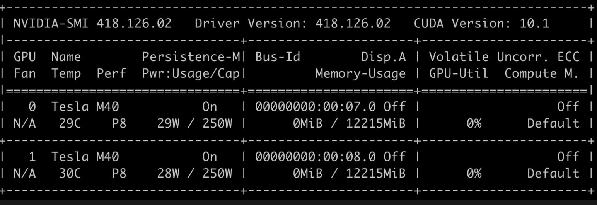

文章介绍：相信大家在平时开发中常常会遇到一些关于作业配置的相关问题，例如如何配置Flink内存才能让作业稳定，高吞吐的运行；Flink是如何对内存管理的；在新的1.12版本中有什么关于内存或者资源的新特性新改变吗？在新的资源扩展框架下，如何利用GPU资源做深度学习或者机器学习的相关作业，你都能在这篇文章中找到答案。

今天就由来自阿里的两位专家，分别是宋辛童和郭旸泽给我们带来Flink在1.12上资源管理新特性的讲解，大家聊一聊关于内存管理以及资源调度相关的一些进展。 议题主要分为2部分，Flink在1.12版本上的高效内存管理和资源调度相关变化将由宋辛童老师讲解，关于扩展资源框架相关问题由郭旸泽老师给大家介绍，关于如何扩展资源框架和以及如何使用GPU进行Flink计算，最后还跟我们讨论了社区在资源管理方面未来的一些规划。

作者：宋辛童（Apache Flink Contributor，阿里巴巴技术专家） 、郭旸泽 （Apache Flink Contributor，阿里巴巴高级开发工程师）

整理：陈政羽（Apache Flink China 社区志愿者）

校对：

# 内存管理

大家可能都有感觉，在我们运行Flink作业时候，该如何配置Flink的一些内存配置选项，我们到底如何去管理它使得Flink作业能够更加高效稳定的运行。在Flink1.10在Flink1.11分别引入了新的内存模型，如下图




从图中我们把我们常常需要关注的内存模块我们圈了起来。因为我们80~90%的用户只需要关心的是这一小部分，它才是真正用于任务执行和具体的作业相关的模块，需要每次去不断调整的部分。其他的大部分是Flink框架的内存，我们认为80~90%的情况可能不需要进行调整，如果一旦出现了问题，在社区的文档中也会很好的帮助大家解决这些问题。哪怕只有图中的4项内存需要我们注意，大家还不得不面临的一个问题：我的一个作业到底需要多少内存才能满足实际生产需求？这里面会存在一些问题：这些内存指标到底是什么？我的作业是否因为内存不足影响了我的作业性能导致吞吐量无法提升？作业是否存在资源浪费的现象？

针对这样的一个问题，我们社区在1.12版本当中给大家提供了一个全新的关于叫manager和task manager的UI（如图所示）



它能够通过网页直观的把每一项监控指标我们的配置值是多少，实际的使用情况是怎么样的，对应到了我们的内存模型当中，对应到哪一项全部都直观的展示给大家，有了这样的一个展示之后，我们可以很清楚的了解到作业的运行情况到底是怎么样的，我们应该去进行如何的调整，然后再配合社区的文档，我们对于每一项的内存具体用哪些配置参数可以来进行调整，通过这种方式的话，希望能够方便到大家对作业的内存管理能够有一个更好的了解。如果大家想对这一项有兴趣可以参考FFA 2020的相关视频。

## 本地内存（Managed Memory）

接下来想重点跟大家聊一下的是关于Flink的托管内存，托管内存实际上是Flink特有的一种**本地内存**，它不受JVM的管理和 GC管理，而是由Flink自行进行管理的这样一类的内存。 

这种内存管理主要体现在两个方面，一个方面是它会进行一个slot级别的，我们叫 **slot级别的预算规划**。它可以保证你在作业运行过程中不会因为内存不足，造成某些算子或者任务无法运行；同时也不会因为说预留了过多的内存没有使用造成这样的一个资源浪费，这是所谓的slot级别的资源规划。 

同时Flink会去保证当你的任务运行结束的时候，它能够准确的把这些内存释放出来，这样Task Manager在用来给新的任务进行执行的时候，内存一定是可用的，这个是一个Flink管理内存的这种方式。托管内存有一个很重要的特性，我们叫做**适应性**。什么叫做适应性？指的是算子对于内存的需求是一个动态可调整的，算子不会因为说给予任务过多的内存，但是实际不需要这么多从而造成一个资源使用上的浪费，它会在一定的合理范围内，不管多少内存都会进行合理的分配；它也不会说给的内存相对比较少导致整个作业无法运行，只是可能在相对比较少的时候会受到一些限制，例如通过频繁的落盘保证作业的运行，这样会导致性能受到一定的影响。以上这就是我们所说的资源适应性。

针对托管内存，目前Flink有以下几个场景是使用的

* RocksDB的状态后端：主要在流计算的使用场景，每个Slot会去使用State的Operator，从而去共享同一块底层RocksDB的缓存块
* Flink内置算子：包含批处理、Table SQL、DataSet API 等算子，每个算子有自己独立的资源预算，不会相互共享
* Python进程：用户使用PyFlink，使用Python语言定义UDF时候需要启动Python的虚拟机进程

## Job Graph 编译阶段

Flink对于management memory的管理，它的预算的管理主要是分为两个阶段，首先第一个阶段是在作业的 job graph编译的阶段，在这个阶段需要主要去搞清楚的是三个问题

第一个问题是：slot当中到底有哪些算子或者任务会同时执行。这个关系到说我在一个查询作业中如何对内存进行规划，是否还有其他的任务需要使用management memory从而把相应的内存留出来。 如果是流式的作业当中，这个问题是比较简单的因为我们需要所有的算子同时的执行，才能保证上游产出的数据能给下游及时的消费掉，这个数据才能够在整个job grep当中流动起来。 但是如果我们是在批处理的一些场景当中，实际上我们会存在两种数据shuffle的模式，一种是pipeline的模式，这种pipeline的模式跟流式是一样的，也就是我们前面听到的blound stream的这种处理方式，我同样是需要上游和下游的算子同时运行，然后上游随时产出，下游随时消费。 



另外一种的话是我们所谓的 batch的 blocking的这种方式，他要求上游把数据全部产出，并且落盘结束之后，下游才能开始读数据。这两种实际上会影响到哪些任务可以同时执行。我们目前在flink当中，他做的是根据作业拓扑图当中的这样的一个边的类型（如图上）。我们划分出了一个我们定义了一个概念叫做pipelined region，也就是全部都由pipeline的边锁连通起来的这样一个子图，我们把这个子图识别出来，用来判断哪些task会同时执行，这个是我们如何回答第一个问题，哪些算子会同时执行。 

然后接下来我们搞清楚的第二个问题就是slot当中我们到底有哪些使用场景？我们刚才介绍了三种manage memory的使用场景。在这个阶段，对于流式作业，我们可能会出现的是像 Python UDF以及State Operator。这个阶段当中我们需要注意的是，我们这里并不能肯定 State Operator是否一定会用到management memory，因为这是跟它的状态类型看的类型是相关的，如果它使用了 RocksDB State Operator，它是需要使用的manage memory的，但是如果它是使用Heap State Backend，它并不需要，但是作业在编译的阶段是并不知道状态的类型，所以这里是需要去注意的。 

然后对于batch的作业的话，我们除了需要搞清楚有哪些使用地方之外，我们还需要去搞清楚一件事情。 我们前面提到过batch的operator，它在使用management memory是一种算子独享的方式，而不是以slot为单位去进行共享。我们需要知道不同的算子到底谁应该分配多少内存，这个事情目前是由目前是由flink的 计划作业来自动的来进行一个设置的，Flink作业编译的阶段主要完成的这几个工作。

## 执行阶段



第一个步骤是我们根据State Backend的类型去判断是否有 RocksDB。如图上所示，同样的刚才我们比如说这样的一个slot，还有ABC三个算字，B跟C分别用到了Python，C用到了State for的 Operator，这种情况下，如果是在heap里边看的情况下，我们走上面的分支，我们整个slot当中只有一种在使用，就是Python。下面的话我们会存在两种使用方式，其中一个是RocksDB State Backend，有了这样的一个第一步的判断之后，第二步我们会去决定根据一个用户的配置，去决定不同使用方式之间怎么样去共享slot的management memory。 

在我们这个Steaming的例子当中，我们定义的是说相当于Python的权重是30%，然后State Backend的权重是70%。在这样的一个情况下，如果我只有 Python的情况下，当然 Python的部分是使用100%的内存（Streaming的Heap State Backend分支）；而对于第二种情况（Streaming的RocksDB State Backend分支），B、C的这两个Operator共用30%的内存用于 Python的 UDF，另外C在独享70%的内存用于 RocksDB State Backend。最后Flink会根据 Task manager的资源配置，一个slot当中到底有多少manager memory来决定每个operator实际可以用的内存的数量。



批处理的情况下跟流的情况有两个不同的地方，首先它不需要去判断State Backend的类型了，这是一个简化； 其次对于batch的算子，我们刚才说每一个算子它有自己独享的这样一个资源的这样一个预算，这种情况下我们会去根据使用率算出不同的使用场景需要多少的Shared之后，我还要把比例进一步的细分到每个Operator。 

## 参数配置

|      |                  配置参数                  |        默认值         |              备注               |
| ---- | :----------------------------------------: | :-------------------: | :-----------------------------: |
| 大小 |      taskmanager.memory.managed.size       |           /           |            绝对大小             |
| 权重 |    taskmanager.memory.managed.fraction     |          0.4          | 相对大小（占用Flink）总内存比例 |
|      | taskmanager.memory.managed.consumer-weight | DATAPROC:70,PYTHON:30 |    多种用途并存时候分配权重     |

这个图表当中展示了我们需要的上面是 manager，memory大小有两种配置方式，一种是绝对值的这种配置方式，还有一种是作为 Task Manager总内存的一个相对值的这样一个配置方式。taskmanager.memory.managed.consumer-weight是一个新加的配置项，它的数据类型是一个map的类型，也就是说我们在这里面实际上是给了一个key冒号value，然后逗号再加上下一组key冒号value的这样的一个数据这样的结构。这里面我们目前支持两种 consumer的 key，一个是DATAPROC， DATAPROC既包含了流处理当中的状态后端State Backend的内存，也包含了批处理当中的 Batch Operator，然后另外一种是Python。

# 资源调度

部分资源调度相关的Feature是其他版本或者邮件列表里面大家询问较多的，这里我们也做对应的介绍

## 最大Slot数



Flink在1.12支持了最大slot数的一个限制（**slotmanager.number-of-slots.max**），在之前我们也有提到过对于流式作业我们要求所有的operator同时执行起来，才能够保证数据的顺畅的运行。在这种情况下，作业的并发度决定了我们的任务需要多少个slot和资源去执行作业，但是对于批处理其实并不是这样的，批处理作业往往可以有一个很大的并发度，但实际并不需要这么多的资源，批处理用很少的资源，跑完前面的任务腾出Slot给后续的任务使用。通过这种串行的方式去执行任务能避免YARN/K8s 集群的资源过多的占用。目前这个参数支持在yarn/mesos/native k8使用

## TaskManager容错

在我们实际生产中有可能程序的错误，网络的抖动，硬件的故障等问题造成TaskManager无法连接，甚至TaskManager直接挂掉。我们在日志中常见的就是TaskManagerLost这样的一个报错。对于这种情况就是需要进行作业重启，在重启的过程中需要重新申请资源和重启TaskManager进程，这种性能消耗代价是非常高昂的。对于稳定性要求相对比较高的作业，Flink1.12提供了这样的一个新的 feature，能够支持在Flink集群当中始终持有少量的冗余的TaskManager，这些冗余的TaskManager可以用于在单点故障的时候快速的去恢复，而不需要等待一个重新的资源申请的这样一个过程。 



通过配置**slotmanager.redundant-taskmanager-num** 可以实现冗余TaskManager。这里所谓的冗余TaskManager并不是完完全全有两个TaskManager是空负载运行的，而是说相比于我所需要的总共的资源数量，会多出两个TaskManager，任务可能是相对比较均匀的分布在上面，在能够在利用空闲TaskManager同时，也能够达到一个相对比较好的负载。 在一旦发生故障的时候，我可以去先把任务快速的调度到现有的还存活的TaskManager当中，然后再去进行一个新一轮的资源申请。目前这个参数支持在yarn/mesos/native k8使用

## 任务平铺分布

任务平铺问题主要出现在Flink Standalone模式下或者是比较旧版本的k8s模式部署下的。在这种模式下因为事先定义好了有多少个TaskManager，每个TaskManager上有多少slot，这样就会导致经常会出现一个调度不均的问题，可能部分manager放的任务很满，有的放的比较松散。在1.11的版本当中引入了这样一个参数**cluster.evenly-spread-out-slots**，这样的参数能够控制它，去进行一个相对比较均衡的这样一个调度。 



注意：这个参数我们只针对的是**Standalone模式**，因为在yarn跟k8s的模式下，我们实际上是根据你作业的需求来决定我要起多少task manager的，所以是先有了需求再有TaskManager，而不是先有task manager，再有 slot的调度需求。 在每次调度任务的时候，实际上我只能看到当前注册上来的那一个TaskManager，Flink没办法全局的知道说后面还有多少TaskManager会注册上来，这也是我们为什么很多人在问的一个问题，就是为什么特性打开了之后好像并没有起到一个很好的效果，这是第一件事情。 

第二个需要注意的点是这里面我们只能决定每一个TaskManager上有多少空闲slot，然而并不能够决定每个operator有不同的并发数，Flink并不能决定说每个operator是否在TaskManager上是一个均匀的分布，因为在flink的资源调度逻辑当中，在整个slot的allocation这一层是完全看不到task的。这2个地方是需要大家注意的

# 扩展资源框架

## 背景

近几年随着人工智能领域的不断发展，深度学习模型也已经被应用在了各种各样的生产场景中，比较典型的应用场景像是推荐系统、广告推送以及一些智能的风险控制。支持AI以及支持这些深度学习模型或者机器学习算法，一直以来都是Apache Flink社区的长期目标规划之一。 针对这些目标，目前已经有了一些第三方的工作，那么目前阿里巴巴去开源，一个是**Flink AI Extended**的项目，那么它是一个基于Flink的深度学习扩展框架，目前它里面支持了TensorFlow和PyTouch这些常用的机器学习框架，那么有了它以后，你就在Flink执行这些框架的运行。

那么另一个就是**Alink**，它是一个基于Flink的通用算法平台，那么里面也内置了一很多常用的机器学习算法，但是以上两个都是从功能性上对Flink进行一些扩展，那么从算力或者说资源的角度上来说，不管是深度学习模型还是机器学习算法，它通常来讲都是我整个作业中的计算瓶颈所在，而GPU则是这个领域被广泛使用的，用来加速这一过程的这么一种资源的设备，那么对于Flink这种对实质性要求比较高的作业，支持机器去加入对GPU的支持就尤为关键了。 

那么何为加入对GPU的支持？首先从这个调度上来讲，那么目前Flink只支持用户去配置CPU，内存这两个维度的资源。如果Flink要加入这一部分的支持，那么我们首先需要允许用户配置我每个TaskManager上面有几个GPU资源，而且部署在yarn或者k8s上时，我还要将这些资源需求进行一个转发。 有了资源以后，第二步就是将GPU的信息传递给算子，那么用户自定义的这些算子需要在运行时获取当前环境，也就是说它 task所执行的 TaskManager中可以使用的这些GPU资源的信息。 

以上两个针对所有扩展资源实际上都是通用的，而针对GPU资源来讲，它有一个特殊的资源隔离需求，GPU的显存资源只支持独占使用，那么如果我们多个TaskManager进程跑在了同一台物理机上的时候，我们需要保证每个GPU只能有一个TM去独占，那么我们的扩展资源框架就是针对调度，还有信息传递这两个通用需求，它抽象出来一个比较高层的框架，任除了不只是GPU任何扩展资源都可以插件的形式来加入我们扩展资源框架。 关于扩展资源框架的具体的实现细节社区的FlIP-108有详细描述，接下来我们从用户的角度上讲一下如何使用扩展资源框架。

## 扩展资源框架使用方法

使用资源框架我们可以分为以下这3个步骤：首先为该扩展资源设置相关配置，然后为所需的扩展资源准备扩展资源框架中的插件，最后在算子中，从RuntimeContext来获取扩展资源的信息并使用这些资源

### 配置参数

```yaml
# 定义扩展资源名称，“gpu”
external-resources: gpu
# 定义每个 TaskManager 所需的 GPU 数量
external-resource.gpu.amount: 1 
# 定义Yarn或Kubernetes中扩展资源的配置键
external-resource.gpu.yarn.config-key: yarn.io/gpu
external-resource.gpu.kubernetes.config-key: nvidia.com/gpu
# 定义插件 GPUDriver 的工厂类。
external-resource.gpu.driver-factory.class: 
org.apache.flink.externalresource.gpu.GPUDriverFactory
```

首先以GPU为例来说一下配置，那么第一个配置就是 external-resources，那么它的值是一个列表，里面包含了你所有去需要的扩展资源的名称，这个名称是大家可以指自己指定的，不一定叫 GPU。但是这个名称之后，你所有扩展资源相关的配置都会以这个名称作为前缀，我们在这里就定义了一个叫做GPU的扩展资源。那么接下来 amount参数设置就是定义了我每个TaskManager上有多少个GPU这种扩展资源，如果你的Flink部署在YARN或者K8s上，你还需要去配置你这种扩展资源。最后如果你为扩展资源准备了插件的话，你需要把插件的工厂类的类名进行配置。 

### 准备插件

根据不同的部署模式去准备不同的插件，如果你是部署一个StandAlone集群的话，那么 GPU资源是需要有你的集群管理员去保证的。也就是说你TM进程起的那些物理机上需要实际有 GPU的设备，那么如果你是执行在YARN模式的话，你需要保证你的Hadoop版本在2.10以及3.1以上，这样的话它才支持一个GPU的调度，并且需要进行 Resource Type的相关配置。如果你是执行在K8s集群的话，需要保证你集群的版本在1.10以上，这样他才支持体 Device plugin机制。

不管是哪个厂商的显卡，我们都需要去安装对应的device plugin，在确保我们TaskManager上有GPU资源以后，我们下一步就是获取 GPU资源的信息，那么你需要准备这么插件，这个插件主要需要实现两个接口，一个是ExternalResourceDriver，一个是ExternalResourceDriverFactory，代码如下

```java
public interface ExternalResourceDriverFactory {
  /**
  * 根据提供的设置创建扩展资源的Driver
  */
  ExternalResourceDriver createExternalResourceDriver(Configuration config) throws Exception;
}

public interface ExternalResourceDriver {
  /**
  * 获取所需数量的扩展资源信息
  */
  Set<? extends ExternalResourceInfo> retrieveResourceInfo(long amount) throws Exception;
}
```

那么ExternalResourceDriver会在每个TaskManager上进行启动，然后框架会调用它的retrieve resource，从而来获取我当前 TaskManager上可见的或者说可以使用的这些扩展资源的信息。那么factory就是 driver的一个工厂类了，他在TaskManager初始化的时候会被用来初始化所有你定义的扩展资源的这些driver。 目前这个插件的核心的功能就是在运行时去获取扩展资源的信息，现在Flink中内置了针对GPU的插件，那么它里边的实现原理也很简单，首先它通过执行一个叫做Discovery的脚本来获取 GPU的信息，那么目前GPU的信息里只包含 GPU设备的index。 

那么详细来讲一下 Discovery script，首先我们是给大家提供了一个默认脚本的，但是用户也可以去自定义去实现一个脚本，并通过一个路径的配置来指定它。 那么如果你要自定义实现的话，那么你需要遵守脚本的协议。 

首先我们的driver会在调脚本的时候将GPU的数量作为第一个参数进行输入，那么之后是接着用户自定义的参数列表，那么如果这个脚本就是执行正常且输出符合你的预期，你需要把 GPU的index列表以逗号分割的形式输出到标准输出；那么如果你脚本执行出错了，或者说你认为结果不符合预期，那么你需要脚本已非零值进行退出。需要注意这也会引发就是TaskManager的初始化失败，那么你的所有标准输出以及错误都会被输出到日志里。 

Flink提供的默认脚本是通过 vdissmi工具来获取当前的机器中可用的GPU数量以及index，它只会返回就是所需数量，例如作业只需要两块GPU，而它发现了三块的话，它会只会截取到前两块，但是如果说你的他发现了这批数量不满足要求的话，他就会以非零值退出。 具体的实现大家感兴趣的话，也可以去flink项目中的plugins/external-resource-gpu/目录下去查看具体实现。

如果在StandAlone模式下，我们还需要保证各个TaskManager进程之间的对GPU的独占的访问，因此默认脚本也提供了一个协调模式，那么你可以在用户自定义参数列表里加入Enable Coordination Mode来启动协调模式，启动以后它会通过一个全局的文件锁来实现GPU信息的同步，以此来协调同一台机器上多个TaskManager进程对GPU资源的使用。

### 使用资源

下面我们根据前面所说的做一个机器学习界的HelloWorld，这个主要是通过手写数字进行识别数据集的一个操作


通过一个预先训练好的DNN网络，输入以后经过一层的全连接网络来得到一个10位的向量，然后经过一个MaxIndexOf的这么一个操作，最终得到我们的识别结果。 

我们的运行环境是在一台有两块GPU的机器上，我们起一个StandAlone集群，然后上面有两个TaskManager进程，那么我们需要保证 TaskManagerr进程分别使用其中一块GPU来不冲突进行计算，这就是通过我们默认脚本的 Coordination Mode来实现的。 

这里简单的介绍一下它的核心类，MNISTClassifier

```java
class MNISTClassifier extends RichMapFunction<List<Float>, Integer> {

  @Override
  public void open(Configuration parameters) {
    //获取GPU信息并且选择第一块GPU
    Set<ExternalResourceInfo> externalResourceInfos =   getRuntimeContext().getExternalResourceInfos(resourceName);
    final Optional<String> firstIndexOptional = externalResourceInfos.iterator().next().getProperty("index");
    // 使用第一块GPU的index初始化JCUDA组件
    JCuda.cudaSetDevice(Integer.parseInt(firstIndexOptional.get()));
    JCublas.cublasInit();
  }
}
```

首先从open方法中的RunTimeContext来获取我们的GPU信息，那么从中选出第一块GPU，用它来初始化机器学习的类库。

map方法中 ，它的输入就是我们手写图片的矩阵。把这个矩阵以及我们之间训练好的模型矩阵都放入GPU，利用库进行一个矩阵乘法的运算，然后把结果从GPU进行一个取出，在本地做一个MaxIndexOf的操作，最终就能得到我们的识别结果了。

在算子中使用GPU

```java
class MNISTClassifier extends RichMapFunction<List<Float>, Integer> {
    @Override
    public Integer map(List<Float> value) {
        // 使用Jucblas做矩阵算法
        JCublas.cublasSgemv('n', DIMENSIONS.f1, DIMENSIONS.f0, 1.0f,
                matrixPointer, DIMENSIONS.f1, inputPointer, 1, 0.0f, outputPointer, 1);

        // 获得乘法结果并得出该图所表示的数字
        JCublas.cublasGetVector(DIMENSIONS.f1, Sizeof.FLOAT, outputPointer, 1, Pointer.to(output), 1);

        JCublas.cublasFree(inputPointer);
        JCublas.cublasFree(outputPointer);

        int result = 0;
        for (int i = 0; i < DIMENSIONS.f1; ++i) {
            result = output[i] > output[result] ? i : result;
        }
        return result;
    }
}
```

运行时使用GPU进行计算



具体案例演示流程可以前往观看视频或者参考Github上面的链接动手尝试

# 未来计划

目前关于资源方面的计划主要有两个方面，首先是被动资源模式，它是指Flink可以根据运行时的可用资源来决定整个job以及各个算子的并发度，而且当可用资源就是发生变化的时候，会根据变化自动的对并发度进行一个调整，这个Feature主要是为了解决我们平常flink跑在k8s或者yarn上的任务，如果资源不够导致作业无法启动执行，有了被动资源模式可以在有限的资源情况下去处理数据。

另一个比较重要的工作就是细粒度的资源管理，那么它允许用户可以为任务指定不同的资源需求，这样在调度的时候就会使用不同规格的TaskManager以及slot做一个TaskManager Slot关于资源的异构。那么它主要是为了对资源的利用效率进行一个优化，尤其是复杂场景的资源利用效率的提升。

# 总结

通过文章的介绍，相信大家对Flink内存管理有了更加清晰的认知。首先从本地内存、Job Graph 编译阶段、执行阶段来解答每个流程的内存管理以及内存分配细节，通过新的参数配置控制TaskManager的内存分配；然后从大家平时遇到资源调度相关问题，包括最大Slot数使用，如何进行TaskManager进行容错，任务如何通过任务平铺均摊任务资源；最后在机器学习和深度学习领域常常用到GPU进行加速计算，通过解释Flink在1.12版本如何使用扩展资源框架和演示Demo给我们展示了资源扩展的使用，最后针对资源利用率方面提出2个社区未来正在做的计划，包括被动资源模式和细粒度的资源管理。

# 附录

[[1] Accelerating your workload with GPU and other external resources](https://flink.apache.org/news/2020/08/06/external-resource.html)

[[2] 扩展资源框架文档](https://ci.apache.org/projects/flink/flink-docs-release-1.11/zh/ops/external_resources.html)

[[3] FLIP-108: Add GPU support in Flink](https://cwiki.apache.org/confluence/display/FLINK/FLIP-108:+Add+GPU+support+in+Flink)

[[4] flink-mnist 项目](https://github.com/KarmaGYZ/flink-mnist)