# 深入解读 Flink SQL 1.13

文章介绍：Flink1.13版本于最近发布了，里面有比较多新的Feature和特性，今天就由我和徐榜江老师带着大家一起去探寻这些新特性，还有一些改进。徐榜江老师目前就职于阿里巴巴 Flink-SQL引擎团队，主要负责社区的SQL引擎模块开发。这篇文章一共会分为4个部分，首先我们会先给大家介绍Flink-SQL在1.13版本上面整体的一个改动，还有一些核心Feature的解读和重要改进，最后就是总结以及Flink1.14一些功能提前和大家剧透。

`作者：徐榜江 （Apache Flink PMC）`
`整理：陈政羽（Apache Flink China 社区志愿者）`

# Flink SQL 1.13概览

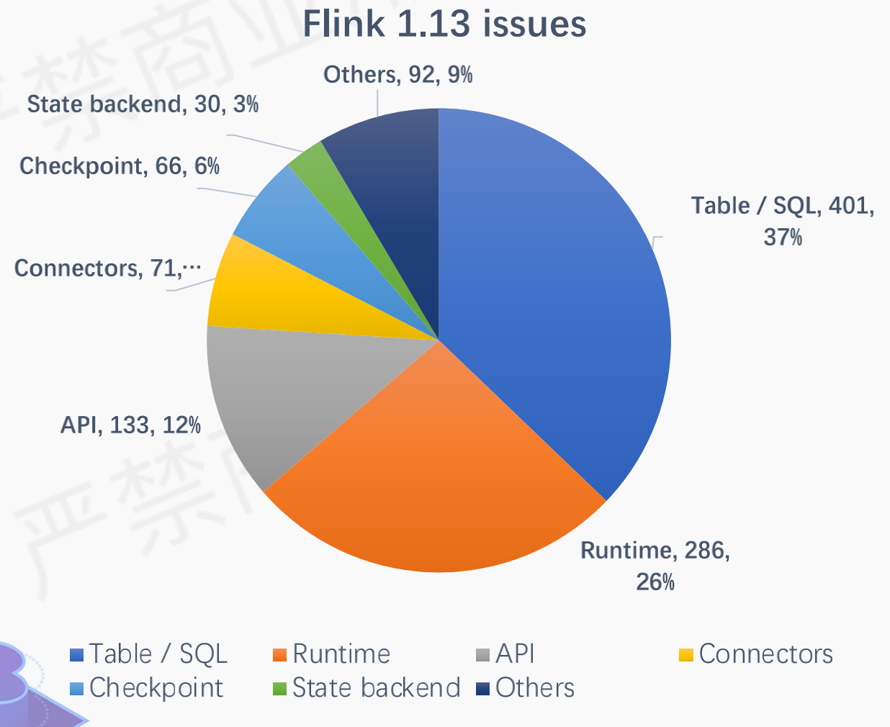

Flink-SQL 1.13是一个社区大版本，解决的issue在1000+以上，通过图中我们可以看到解决的问题大部分是关于Table-SQL模块，一共400多个issue占了37%左右，主要是围绕了其中的5个Flip进行展开，稍后文章我们也会根据这5个进行描述，它们分别是

- FLIP-145: 支持 Window TVF
- FLIP-162: SQL层面把时区和时间函数进行修正优化
- FLIP-152: 提升 Hive 语法兼容性
- FLIP-163: 改进 SQL Client，使得生产基本可用
- FLIP-136: 增强 DataStream 和 Table 的转换的增强

下面我们来通过逐个Feature进行解读

## FLIP-145：支持Windows TVF

在腾讯、阿里、字节等内部已经有这个功能，这次社区在Flink1.13我们推出了TVF的相关支持和相关优化。下面将从 Window TVF 语法、近实时累计计算场景、 Window 性能优化、多维数据分析进行解剖这个新功能

### Window TVF 语法

在1.13 前，是一个特殊的GroupWindowFunction

```sql
SELECT 
	TUMBLE_START(bidtime,INTERVAL '10' MINUTE),
  TUMBLE_END(bidtime,INTERVAL '10' MINUTE),
  TUMBLE_ROWTIME(bidtime,INTERVAL '10' MINUTE),
  SUM(price)
FROM MyTable
GROUP BY TUMBLE(bidtime,INTERVAL '10' MINUTE)
```

在1.13时候我们对它进行了Table-Valued Function的语法标准化

```sql
SELECT window_start,window_end,window_time,SUM(price) 
FROM TABLE(TUMBLE(TABLE mytable,DESCRIPTOR(biztime),INTERVAL '10' MINUTE))
GROUP BY window_start,window_end
```

通过上面的观察，我们可以发现TVF 无需一定要跟在GROUP BY 语法后面，在Window TVF 基于关系代数 ，使得更加标准化。划分窗口只需要TVF，无需再次进行GROUP BY的相关操作；TVF扩展性和表达能力更强，可以自定义TVF（例如topn）

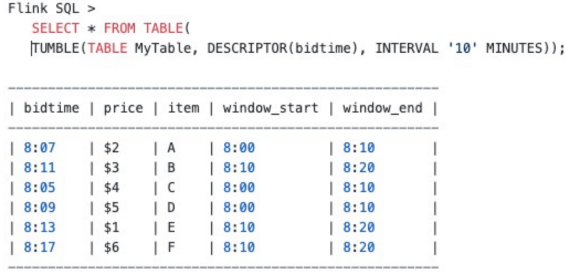

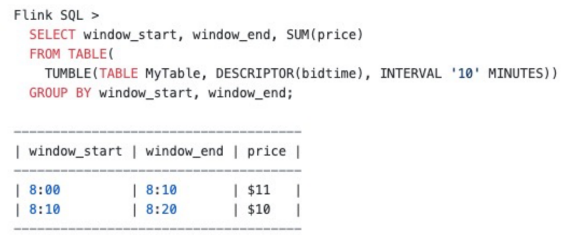

以上例子就是TVF做一个窗口划分，只需要把数据划分到窗口无需聚合，如果后续需要聚合只需要GROPBY即可。对于批的用户操作是很自然的一件事，而不需要像1.13之前做一定需要一个特殊的GROUP Function

目前WINDOW TVF 支持TUMBLE，HOP WINDOW；新增了CUMULATE WINDOW，SESSION WINDOW 预计在1.14支持

### Cumulate Window

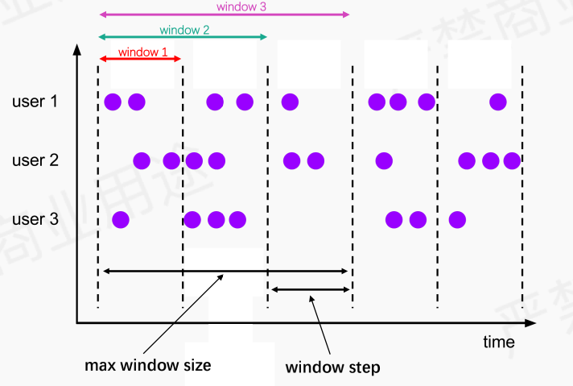

以图里面一个宽度为单位，第一个window统计一个宽度的数据，第二个window是想统计第一+第二个宽度的数据，第三个window想统计 1 2 3 宽度的数据。这个就是累积计算场景UV。例如：UV大盘曲线：每隔10分钟统计一次当天累积用户uv。在Flink1.13之前，我们需要做这个场景我们一般做法如下

```sql
INSERT INTO cumulative_uv
SELECT date_str,MAX(time_str),COUNT(DISTINCT user_id) as uv
FROM (
	SELECT
  	DATE_FORMAT(ts,'yyyy-MM-dd') as date_str,
  	SUBSTR(DATE_FORMAT(ts,'HH:mm'),1,4) || '0' as time_str,
  	user_id
  FROM user_behavior
)
GROUP BY date_str
```

把时间戳取出按照GROUP BY 取出来，然后再做聚合操作，在里面按照10分钟进行截取，这样达到近似计算的场景 
Flink1.13前做法：弊端 逐条计算，追逆数据时候，如果在生产和消费速度相同时候，就会如上图 曲线会比较平稳，但是生产和消费速度不匹配的时候就会跳变。

在Flink1.13可以改变我们的做法，当我们拥有了cumulate windows 时候 我们可以修改为下面的语法，每条数据精确分到每个window里面，例如我们是按照event_time进行划分的时候就会

```sql
INSERT INTO cumulative_uv
SELECT window_end,COUNT(DISTINCT user_id) as uv
FROM TABLE(
	CUMULATE(TABLE user_behavior,DESCRIPTOR(ts),INTERVAL '10' MINUTES,INTERVAL '1' DAY))
)
GROUP BY window_start,window_end
```

最终实现效果如下图

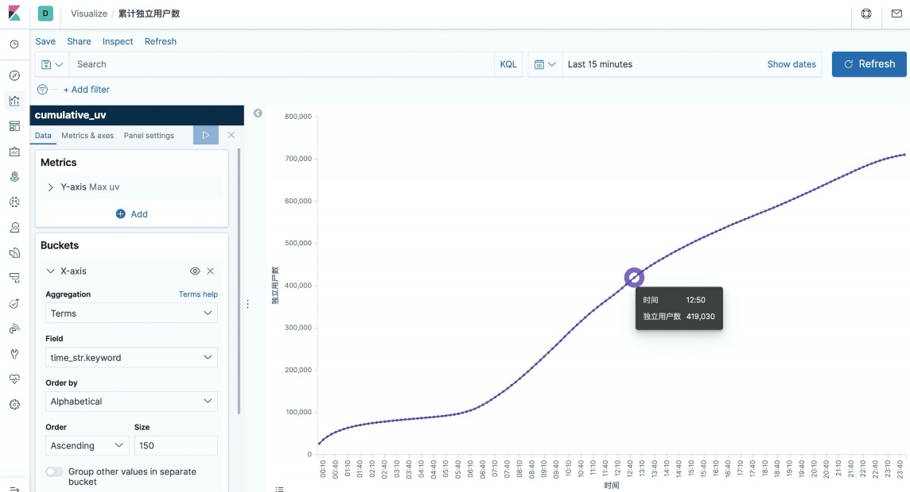

### Window 性能优化

内存优化：通过内存预分配，缓存 window 的数据，通过 window watermark 触发计算，通过申请一些buffer避免高频的访问state

切片优化：将 window 切片，尽可能复用已计算结果，如 hopwindow,cumulate window。计算过的window数据无需再次计算，对切片进行重复利用数据

算子优化：window 支持，local-global 优化；同时支持count(distinct) 自动解热点优化

迟到数据：支持迟到数据计算到后续分片， 保证数据准确性 

通过开源 Benchmark (Nexmark) 测试，普适性能有 2x 提升，在 count(distinct) 场景会有更好的性能提升

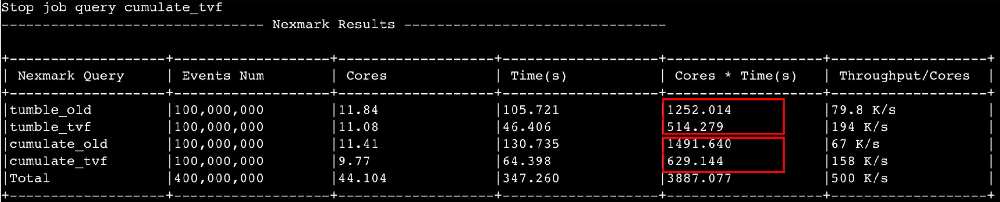

### 多维数据分析

语法的标准化带来了更多的灵活性和扩展性，它可以直接在window窗口函数上面进行多维分析，如下图所示，可以直接进行GROUPING SETS、ROLLUP、CUBE的计算，如果是在1.13之前的版本，我们可能需要对这些进行单独的编写SQL后，再做union的一些聚合才能获得结果。类似这种多维分析的场景，可以直接在window-tvf上面实现

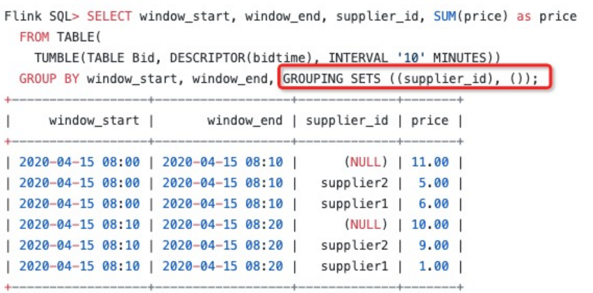

支持WINDOW TOP-N

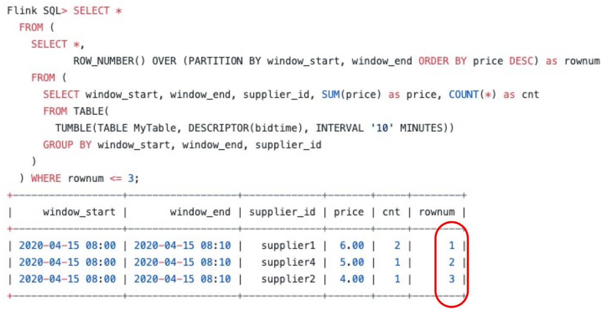

## FLIP-162: 时区和时间函数

### 时区问题分析

时区问题可以归纳为3个主要原因：

- PROCTIME() 应该考虑时区，但未考虑时区
- CURRENT_TIMESTAMP/CURRENT_TIME/CURRENT_DATE/NOW() 未考虑时区
- Flink在时间属性上面只支持定义在TIMESTAMP这种数据类型上面，这个类型没有考虑时区。TIMESTAMP 类型不考虑时区，但用户希望是本地时区的时间

| 时间函数          | Flink 1.13之前                                               | Flink1.13                                                    |
| ----------------- | ------------------------------------------------------------ | ------------------------------------------------------------ |
| CURRENT_TIMESTAMP | 返回类型: TIMESTAMP<br/>UTC+0时区: 2021-05-22 01:40:52<br/>UTC+8时区: 2021-05-22 01:40:52 | 返回类型: TIMESTAMP_LTZ<br/>UTC+0时区: 2021-05-22 01:40:52<br/>UTC+8时区: 2021-05-22 09:40:52 |
| PROCTIME()        | 返回类型: TIMESTAMP *PROCTIME*<br/>UTC+0时区: 2021-05-22 01:40:52<br/>UTC+8时区: 2021-05-22 01:40:52 | 返回类型: TIMESTAMP_LTZ *PROCTIME*<br/>UTC+0时区: 2021-05-22 01:40:52<br/>UTC+8时区: 2021-05-22 09:40:52 |

针对TIMESTAMP类型没有携带时区问题，我们推出了TIMESTAMP_LTZ 类型，LTZ是Local Time Zone的缩写，我们可以通过下面的表格来对比和TIMESTAMP两者的对比

| 数据类型                        | 缩写              | 含义                                                         |
| ------------------------------- | ----------------- | ------------------------------------------------------------ |
| TIMESTAMP (p) WITHOUT TIME ZONE | TIMESTAMP (p)     | 用于描述年， 月， 日， 小时， 分钟， 秒 和 小数秒<br/>TIMESTAMP 可以通过一个字符串来指定 |
| TIMESTAMP (p) WITH LOCAL TIME   | TIMESTAMP_LTZ (p) | 用于描述时间线上的绝对时间点，类似System.currentTimeMillis()<br/>没有字符串表达形式<br/>在计算和可视化时， 使用 session 中配置<br/>的时区。 |

TIMESTAMP_LTZ  区别于之前我们使用TIMESTAMP，它是表示绝对时间的含义，通过对比我们可以发现，如果我们配置使用TIMESTAMP类型，他可以是字符串类型的。不管是从英国还是中国来说来对比这个值，其实都是一样的；但是对于TIMSTAMP_TLZ来说，它的来源就是一个Long值，在不同的时区去观察这个数据是不一样的，这样更加符合用户在实际生产上面一些需求。

### 时间函数纠正 

**订正 PROCTIME() 函数**

当我们有了TIMESTAMP_LTZ 这个类型的时候，我们对PROCTIME()类型做了纠正，在1.13之前它总是返回UTC的TIMESTAMP，我们现在进行了纠正，把返回类型变为了TIMESTAMP_LTZ。PROCTIME除了表示函数之外，PROCTIME也可以表示时间属性的标记，下图我们通过创建这些时间类型的一张demo表可以看到类型发生的变化

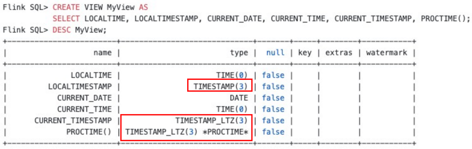

**订正 CURRENT_TIMESTAMP/CURRENT_TIME/CURRENT_DATE/NOW() 函数**

这些函数在不同时区下出来的值是会发生变化的，例如在英国UTC时区时候是凌晨2点，但是如果你设置了时区是UTC+8的时候，时间是在早上的10点，不同时区的实际时间会发生变化，效果如下图：

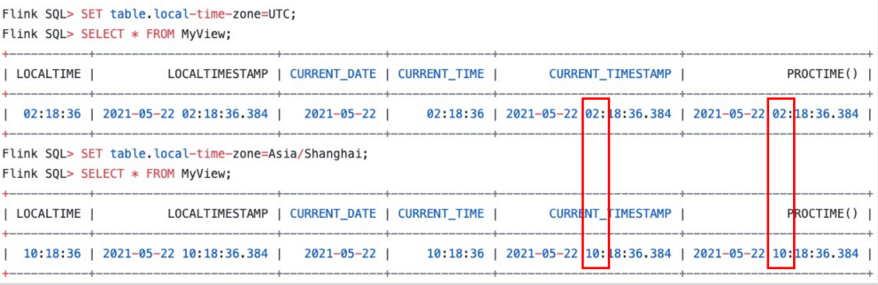

**解决 processing time window 时区问题**

PROCTIME可以表示一个时间属性，我们基于PROCTIME的WINDOW操作，在Flink1.13之前如果我们需要做按天的window操作，进行按天WINDOW你需要手动解决时区问题，去做一些8小时的偏移然后再减回去。在FLIP-162解决了这个问题，现在用户使用的时候十分简单，PROCTIME直接声明了，结果是本地的时区。例如下图案例，英国时区的window_end 和 中国时区 的window_end会发生变化

```sql
FLINK SQL> CREATE TABLE MyTable(
	item STRING,
  price DOUBLE,
  proctime as PROCTIME()
) WITH(...);

FLINK SQL> CREATE VIEW MyView AS
SELECT
	TUMBLE_START(bidtime,INTERVAL '10' MINUTE),
  TUMBLE_END(bidtime,INTERVAL '10' MINUTE),
  TUMBLE_ROWTIME(bidtime,INTERVAL '10' MINUTE),
  item,
  SUM(price) as max_price
FROM MyTable
GROUP BY TUMBLE(bidtime,INTERVAL '10' MINUTE),item
```

我们通过设置不同的时区去对比发现实际window聚合的时间区间会有所变化

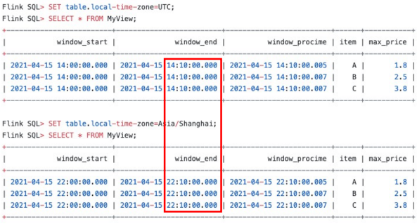

**订正 Streaming 和 Batch 模式下函数取值方式**

时间函数其实在流和批上面表现的形式会有所区别，主要这次修正是让用户更加符合实际的使用习惯。例如一下函数，在流模式中是per-record计算（在流模式下，是逐条数据的时间），在batch模式是query-start计算，（例如我们在使用一些离线计算引擎，hive  就是每一个批作业实际运行的时间）

Streaming 模式 per-record 计算，Batch 模式在 query-start 计算：

- LOCALTIME
- LOCALTIMESTAMP
- CURRENT_DATE
- CURRENT_TIME
- CURRENT_TIMESTAMP
- NOW()

Stream 和 Batch 模式都是 per-record 计算：

- CURRENT_ROW_TIMESTAMP()
- PROCTIME()

### 时间类型使用

EVENT_TIME 在Flink1.13也支持了定义在TIMESTAMP列上，相当于EVENT_TIME现在目前支持定义在TIMESTAMP和TIMESTAMP_
LTZ上面。

当你上游源数据包含了字符串的时间（如：2021-4-15 14:00:00）这样的场景，直接声明为TIMESTAMP然后把EVENT_TIME直接定义在上面即可，WINDOW窗口在计算的时候会基于你的字符串进行切分，最终会符合你实际想要的预想结果；


当你上游数据源的打点时间是属于long值，表示是一个绝对时间的含义。Flink1.13你可以把EVENT_TIME定义在TIMESTAMP上面，然后通过转换为TIMESTAMP_LTZ类型在window上面做一些聚合，在不同时区上面看到的值就是不一样的，自动的解决了8小时的时区便宜问题，无需人工干预在SQL语句查询层面做语法的修改

小提示：Flink-SQL标准里面的进行订正，在各位进行版本的时候需要留意作业逻辑中是否包含此类函数，避免升级后业务受到影响


### 夏令时支持

对于国外夏令时，以前在做相关窗口计算操作是十分困难的一件事，Flink 支持在 TIMESTAMP_LTZ 列上定义时间属性， Flink SQL 在 window 处理时结合 TIMESTAMP 和 TIMESTAMP_LTZ， 优雅地支持了夏令时。主要是针对海外的业务统计场景会比较友好

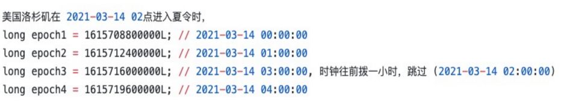

在洛杉矶时区，[2021-03-14 00:00, 2021-03-14 00:04] 窗口会收集 3 个小时的数据
在非夏令时区，[2021-03-14 00:00, 2021-03-14 00:04] 窗口会收集 4 个小时的数据

# Flink SQL重要改进

## FLIP-152：提升Hive 语法兼容性

这个主要是做了Hive语法的兼容性增强，首先支持了Hive的一些常用DML和DQL语法，这里列举部分

- SORT/CLUSTER/DISTRIBUTE BY
- Group By
- Join
- Union
- LATERAL VIEW
- Window Functions
- SubQueries
- CTE
- INSERT INTO dest schema
- Implicit type conversions

Hive dialect 支持 Hive 常用语法，hive有十分多内置函数，Hive dialect 需要配合 HiveCatalog 和 Hive Module 一起使用，Hive Module 提供了 Hive 所有内置函数，加载后可以直接访问

```shell
FLINK SQL> CREATE CATALOG myhive WITH ('type'='hive'); --setup HiveCatalog
FLINK SQL> USE CATALOG myhive;
FLINK SQL> LOAD MODULE hive; --setup HiveModule
FLINK SQL> USE MODULES hive,core;
FLINK SQL> SET table.sql-dialect = hive; -- enable Hive dialect
FLINK SQL> SELECT ket,value FROM src CLUSTER BY key; --run some Hive queries
```

与此同时，我们还可以通过Hive dialect 创建/删除 Catalog 函数以及一些自己自定义的一些函数，对用户使用起来会更加方便

```shell
FLINK SQL> SHOW FUNCTIONS;
FLINK SQL> CREATE FUNCTION function_name AS class_name; --create function
FLINK SQL> DROP FUNCTION [IF EXISTS] function_name;
```

## FLIP-163：改进的SQLClient

在Flink1.13之前，大家觉得就是Flink SQL Client就是周边的一个小工具，在FLIP-163进行重要改进：

1. 通过-i的参数，提前把DDL一次性加载初始化，方便初始化表的多个DDL语句，无需再多次使用command命令逐条发送，通过替代以前yaml方式去创建表

   ```shell
   ./sql-client.sh -i inin.sql
   ```

2. -f 参数，其中SQL文件支持DML（insert into）语句

   ```shell
   ./sql-client.sh -i inin.sql -f sqlfile
   ```

3. 支持更多实用的配置

   - 通过 **SET sql-client.verbose = true** , 开启verbose，通过开启verbose打印整个信息，相对以前只输出一句话更加容易追踪错误信息
   - 通过 **SET execution.runtime-mode=streaming / batch** 支持设置批/流作业模式
   - 通过 **SET pipline.name=my_flink_job** 设置作业名称
   - 通过 **SET execution.savepoint.path=/tmp/flink-savepoints/savepoint-bb0dab** 设置作业savepoint路径
   - 对于有依赖的管道作业，通过 **SET table.dml-sync=true** 去选择是否异步执行，例如作业a跑完才能跑作业b的离线作业通过设置为true去执行有依赖关系的pipeline作业

4. 支持STATEMENT SET

   ```shell
   FLINK SQL> BEGIN STATEMENT SET;
   FLINK SQL> INSERT INTO pageview_pv_sink
   				 > SELECT page_id,COUNT(1) FROM clicks GROUP BY page_id;
   FLINK SQL> INSERT INTO pageview_uv_sink
   				 > SELECT page_id,COUNT(DISTINCT user_id) FROM clicks GROUP BY page_id;
   FLINK SQL> END;			
   ```

   有可能我们一个查询不止写到一个sink里面，我需要输出到多个sink，一个sink写jdbc 一个sink写到hbase；在1.13之前需要启动2个query去完成这个作业，然后1.13我们可以把这些放到一个statement里面以一个作业的方式去执行，能够做到 source的复用，节约资源

## FLIP-136：增强DataStream 和 Table 的转换

虽然SQL大大降低了我们使用实时计算的一些使用门槛，但是TABLE和SQL以前我们在ds和table之间的转换比较不方便，对于一些底层封装我们上层sql用户无法直接拿到，例如访问state去做操作，flip-136就是解决这个问题的。

- 支持 DataStream 和 Table转换时传递 EVENT TIME 和WATERMARK

```java
Table table = tableEnv.fromDataStream(
	dataStream,
  Schema.newBuilder()
  .columnByMetadata("rowtime","TIMESTMP(3)")
  .watermark("rowtime","SOURCE_WATERMARK()")
  .build());
)
```

- 支持 Changelog 数据流在 Table 和 DataStream 间相互转换

```java
//DATASTREAM 转 Table
StreamTableEnvironment.fromChangelogStream(DataStream<ROW>): Table
StreamTableEnvironment.fromChangelogStream(DataStream<ROW>,Schema): Table
//Table 转 DATASTREAM
StreamTableEnvironment.toChangelogStream(Table): DataStream<ROW>
StreamTableEnvironment.toChangelogStream(Table,Schema): DataStream<ROW>  
```

# Flink1.14 SQL 未来规划

Flink1.14 主要有以下这几点的规划：

- Flink1.9开始，阿里贡献了新的Blink-Planner后，很多一些新的Feature已经基于此Planner进行开发，所以以前旧的Legacy Planner会彻底删除
- 完善WINDOW TVF，目前还要SESSION WINDOW正在开发，预计1.14会和大家见面
- 提升Schema Handling，Schema校验的提升
- 增强Flink CDC 支持，增强对上游CDC系统的一个集成能力

# 总结

通过上面的文章的介绍，我们可以知道1.13 SQL主要就是围绕着这5部分去展开探讨的：

- Flink-SQL上统一的支持了window tvf
- 统一的解决了时区和时间函数问题
- 提升hive和flink的兼容性
- 改进sql client
- 对高级用户 使用 DS 和 Table的转换增强

最后还分享了关于Flink1.14 SQL 上面的一些未来规划，看完文章的小伙伴相信大家对Flink SQL 在这个版本中变化有了深刻的了解，在实践过程中大家可以多多关注这些新的改动和变化带来业务层面上面的便捷。
