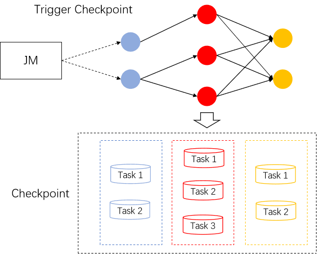
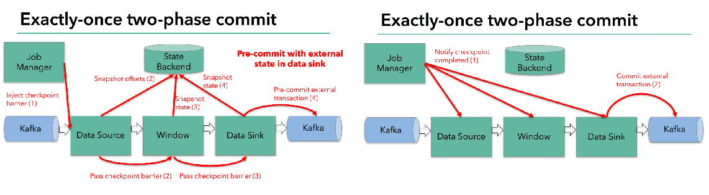
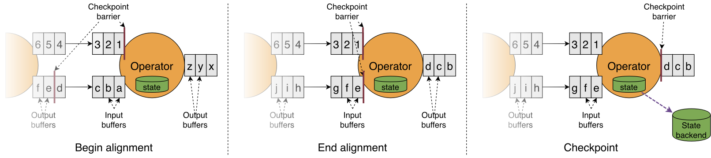
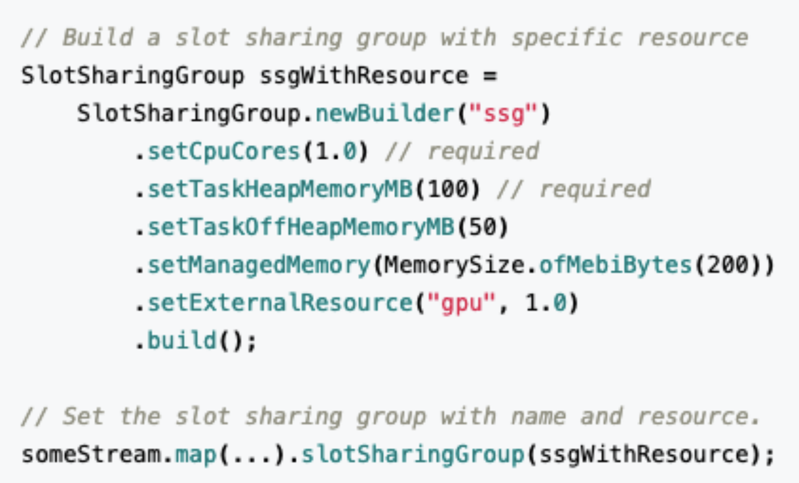
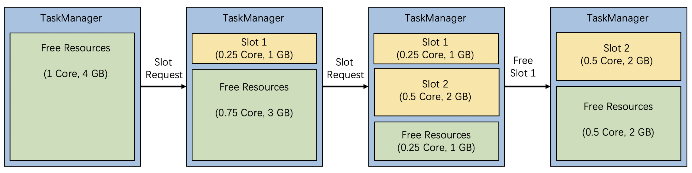

文章介绍：Flink1.14版本发布在即，各位小伙伴是不是已经迫不及待了呢。在Flink1.14中带来的变化将在这篇文章逐一进行简单介绍。我们首先先会回顾一下社区在Flink1.14的一些开发状态以及进度。然后来探讨一下社区在批流一体这个方向上的技术改进，批流一体作为社区重要的重要路线，所以对于批流一体的改进是十分重要的。与此同时我们还会探讨checkpoint机制调整、优化以及后续工作；同时进行引擎和资源效率优化的介绍；最后介绍Table-SQL-Api上面发生的改动，让用户在使用高级API时候更加方便。这次给我们带来分享的是阿里巴巴开源大数据平台技术专家宋辛童，花名五藏，Apache Flink PMC Member & Committer Flink 1.14 Release Manager

作者：宋辛童（花名：五藏） Apache Flink PMC Member & Committer

整理：陈政羽（Apache Flink China 社区志愿者）

# 简介
1.14这个新版本一共有35个比较重要的新特性以及一些优化工作，目前已经有26个工作完成，5个任务不确定是否能准时完成，有4个特性放到后续版本完成。

在这个版本在历史当中囊括的优化和新增功能点其实并不算非常的多，其实大家通过观察发版节奏可以发现通常发布1-2个大版本后都会发布一个变化改动稍微少一点的版本，主要目的是把一些特性更加稳定下来。所以我们1.14版本的定位就是这样的一个定位，我们称之为质量改进和维护的一个版本。这个版本预计8.16停止新特性开发，大概9月中能够和大家正式见面，大家有兴趣可以关注以下链接去跟踪功能发布进度

- Wiki [https://cwiki.apache.org/confluence/display/FLINK/1.14+Release](https://cwiki.apache.org/confluence/display/FLINK/1.14+Release)
- Jira [https://issues.apache.org/jira/projects/FLINK/versions/12349614](https://issues.apache.org/jira/projects/FLINK/versions/12349614)
# 流批一体
Flink流批一体其实从1.9版本开始大家就受到持续的关注，它作为社区RoadMap重要组成部分，随着大数据不断推进的实时化。但是传统的离线的需求并不会给实时任务完全取代，还会是长期存在的一个状态。按照以往流批独立技术方案的痛点，维护两套系统，两套开发人员，两套数据链路处理相似内容带来维护的风险性和冗余，同时有可能是流批使用的不是同一套数据处理系统，引擎本身差异可能存在数据口径不一致的问题，从而导致业务数据存在一定的误差。所以Flink社区定制的目标是实时离线一体化这个技术路线，这个比较重要的技术趋势和方向。

Flink在过去的几个版本当中流批一体完成了非常多的一个工作，在目前引擎层面来看，API 算子执行层面上做到流批同一套机制运行。在任务具体的执行模式上会有2种不同执行模式。对于无限的数据流我们统一采用了流的执行模式，流的执行模式指的是所有是通过一个Pipeline模式去连接的，流的执行模式是上游和下游数据是同时运行的，随着上游不断产出数据，下游不断消费数据。这种称为全Pipeline的执行方式，它可以通过eventTime表示数据什么时候产生的；通过watermark得知目前哪个时间点数据已经到达了；通过state 来维护计算中间状态；通过checkpoint 做容错的处理。如下图是不同的执行模式

对于有限的数据集有2种模式，我们可以把它看成一个有限的数据流去做处理，也可以把它看成批的执行模式。批的执行模式虽然有eventTime，但是对于watermark来说只有正无穷。如果基于数据的state排序后，它在任务的调度和shuffle上会有更多的选择。流批的执行它们2者是有区别的，例如批的执行模式会有落盘的中间过程，只有当前面任务执行完成，下游的任务才会触发，这个容错机制是通过suffle进入容错。这2者各自有各自的执行优势：对于流的执行模式来说，它没有落盘的压力，容错是基于数据的分段，通过不断对数据进行打点checkpoint去保证断点恢复，然而在批处理上，因为是要经过shuffle落盘的，所以对磁盘会有压力，但是因为我数据是经过排序的，所以对批来说可能后续的计算效率会有一定的提升，同时在执行时候我们是经过分段去执行任务的，无需同时执行。容错计算方面是根据stage进行容错，这两种各自优劣进行不同场景进行选择。

Flink1.14优化点主要是针对在流的执行模式下，如何去处理有限数据集。之前处理无限数据集和有限数据集最大区别是任务可能结束的问题。我们来看看下图

在流checkpoint机制，对于一个无限流，它的所有checkpoint是由source节点进行触发的，由source节点发送checkpoint Barrier ，当checkpoint Barrier流过整个作业时候，同时这个checkpoint会存储当前作业所有的state状态。在有限流的checkpoint机制中，我们的task是有可能提早完成任务结束的。上游的Task有可能先处理完任务提早退出了，但是下游的task还是在执行中。在同一个stage不同并发下，有可能数据量不一致导致部分任务提早完成了。这种情况下，后续如果进行checkpoint

我们引入了JobManager动态根据当前任务的执行情况，去明确checkpoint Barrier 是从哪里开始触发的一个机制。同时我们在部分任务结束后，后续的checkpoint只会保存 仍然在运行task所对应的stage，通过这种方式我们能够让任务执行完成后 还可以继续做checkpoint ，在有限流执行当中更好的保障

**Task结束后二阶段提交**

我们在部分sink使用上，例如下图的Kafka Sink上，涉及到 Task 需要依靠checkpoint机制，进行二阶段提交，从而保证数据的Exactly-once 一致性

具体而言可以这样说：在checkpoint过程中，每个算子只会进行准备提交的操作。比如数据会提交到外部的临时存储目录下，所有任务都完成这次checkpoint之后会收到一个信号，才会执行真正的commit。它会把所有分布式的临时文件一次性以事务的方式提交到外部系统。这种算法在当前有限流的情况下，作业结束后并不能保证有 Checkpoint，那么最后一部分数据如何提交？在1.14中我们让task数据处理完成后，Task 等待 Checkpoint 完成后才可以正式的退出，这样可以针对有限流可能一些任务结束的改进

# Checkpoint机制
## 现有checkpoint机制痛点
目前Flink触发checkpoint是依靠barrier在算子进行流通，当算子遇barrier随着算子一直往下游进行发送，当下游遇到barrier的时候就会进行快照操作，然后再把barrier往下游继续发送。对于多路的情况我们会把barrier进行对齐，把先到barrier的这一路数据暂时性的block，等到两路 barrier 都到了之后我们才做快照，最后才会去继续往下继续发送barrier。

现有的CheckPoint机制很明显存在以下问题：

- 反压时无法做出 checkpoint ：在反压时候 barrier 无法随着数据往下游流动，造成反压时候无法做出checkpoint。但是其实我们在发生反压这种情况的时候我们更加需要去做出对数据的checkpoint，因为这个时候是性能遇到了瓶颈，反而是更加容易出问题的阶段
- Barrier 对齐阻塞数据处理 ：对于性能上阻塞对齐存在一定的影响
- 恢复性能受限于 checkpoint 间隔 ：在做恢复时候延迟受到多大的影响很多时候是取决于CheckPoint的间隔，间隔越大，需要replay的数据就会越多，从而造成中断的影响也就会越大。但是目前checkpoint间隔受制于持久化操作的时间，所以没办法做的十分快
## Unaligned Checkpoint
针对这些痛点Flink在最近几个版本一直在持续的优化，**Unaligned Checkpoint** 就是其中一个机制。barrier算子在到达input buffer最前面的时候，我们就会开始触发CheckPoint操作。它会立刻把barrier传到算子的Out Put Buffer的最前面，相当于会立刻被下游的算子所读取到。通过这种方式可以使得barrier 不受到数据阻塞，解决反压时候无法进行Checkpoint。当我们把barrier发下去后，我们需要做一个短暂的暂停，暂停时候我们会把算子的State 和 input output buffer 中的数据进行一个标记，以方便后续随时准备上传。对于多路情况会一直等到另外一路barrier到达之前数据，全部进行标注。通过这种方式整个在做Checkpoint的时候，也不需要对barrier进行对齐，唯一需要做的停顿就是在整个过程中对所有buffer和state标注的这样一个过程。这种方式可以很好的解决了反压时无法做出 checkpoint  和 Barrier 对齐阻塞数据影响性能处理

## Generalized Incremental Checkpoint
这个主要是用于减少Checkpoint间隔，如左图1所示，在Incremental Checkpoint  当中，先让算子写入state 的 changelog。写完后才把变化真正数据写入到StateTable上。state 的 changelog不断的向外部进行持久的存储化。在这个过程中我们其实无需等待整个StateTable去做一个持久化操作，我们只需要保证对应的Checkpoint这一部分的changelog能够持久化完成，就可以开始做下一次checkpoint。StateTable是以一个周期性的方式，独立的去对外做持续化的一个过程。

这两个过程进行拆分后，我们就有了从以前需要做**全量持久化（Per Checkpoint）变成** **增量持久化 （Per Checkpoint）+ 后台周期性 全量持久化**，从而达到同样容错的一个效果。在这个过程中我每一次checkpoint需要做持久化的数据量减少了，从而我做checkpoint的间隔能够大幅度减少。其实在RocksDB也是能支持 Incremental Checkpoint 。但是有两个问题，第一个问题是RocksDB的Incremental Checkpoint  是依赖它自己本身的一些实现，当中会存在一些数据压缩，压缩所消耗的时间以及压缩效果具有不确定性，这个是和我们的数据相关的；第二个问题是只能针对特定的StateBackend来使用，目前在做Generalized Incremental Checkpoint  实际上能保证是对于StateBackend无关的，从运行时的机制来保证了一个比较稳定、更小的Checkpoint间隔。

目前 Unaligned Checkpoint  是在Flink1.13就已经发布了，在1.14版本主要是针对bug的修复和补充，Generalized Incremental Checkpoint  目前社区还在做最后的冲刺，是比较有希望在1.14中和大家见面。

# 性能与效率
## 大规模作业调度的优化

- 构建Pipeline Region的性能提升：所有由pipline边所连接构成的子图 。在Flink任务调度中需要识别这些Pipeline Region 来保证同一个Pipline连接的边的任务进行同时调度。否则有可能上游的任务开始调度，但是下游的任务并没有运行。从而导致上游运行完的数据无法给下游的节点进行消费，可能会造成死锁的情况
- 任务部署阶段：每个任务都要从哪些上游读取哪些信息，所以我们会生成Result Partition Deployment Descriptor 

这2个构建过程在之前的版本都有o（n^2）的时间复杂度，主要问题需要对于每个下游节点去遍历每一个上游节点的情况。例如去遍历每一个上游是不是一个Pipeline 边连接的关系，或者我要去遍历它的每一个上游生成对应的Result Partition 信息。我们通过引入group概念，假设我们已知上下游2个任务的连接方式是out to out，那我们相当于把所有Pipeline Region信息 或者 Result Partition 信息以Group的形式进行组合，这样只需知道下游对于的是上游的哪一个group就可以，通过一个简单的wordcount测试对比优化前后的性能如下表格

|                          | **执行模式** | **并发度** | **优化前** | **优化后** |
| :----------------------: | :----------: | :--------: | :--------: | :--------: |
| **构建 Pipeline Region** |      流      |  8k x 8k   |  3s 441ms  |    22ms    |
|                          |              | 16k x 16k  | 14s 319ms  |   107ms    |
|                          |      批      |  8k x 8k   |  8s 941ms  |   124ms    |
|                          |              | 16k x 16k  | 34s 484ms  |   308ms    |
|       **任务部署**       |      流      |  8k x 8k   | 32s 611ms  |  6s 480ms  |
|                          |              | 16k x 16k  | 129s 408ms | 19s 051ms  |

从表格中可以看到构建速度具有大幅度提升，构建Pipeline Region 的性能从秒级提升至毫秒级别。任务部署我们是从第一个任务开始部署到所有任务开始运行的状态，我们这边只统计了流，因为批需要上游结束后才能结束调度。整体时间来看，整个任务初始化，调度等流程减少到分钟级的消耗
## 细粒度资源管理
细粒度资源管理在历史比较多的版本我们一直在做，在Flink1.14我们终于可以把这一部分API暴露出来在DataSteam提供给用户使用了。用户可以在DataStream中自定义SlotSharingGroup的划分情况，如下图所示可以这样去定义Slot的资源划分。通过这样实现了支持 DataStream API，自定义 SSG 划分方式以及资源配置 TaskManager 动态资源扣减

对于每一个Slot可以通过比较细粒度的配置，通过这样我们在Runtime上会自动根据用户资源配置进行动态的资源切割，切割后如图下

这样做的好处而不会像之前那样会有固定资源的Slot，而是做资源的动态扣减，通过这样的方式希望能够达到更加精细的资源管理和资源的使用率

# Table SQL & Python API
Window Table-Valued Function 支持更多算子与窗口类型 ，可以看如下表格对比

|  | **Tumble** | **Hop** | **Cumulate** | **Session** |
| :-: | :-: | :-: | :-: | :-: |
| **Aggregate** | 1.13 | 1.13 | 1.13 | 1.14 |
| **TopN** | 1.13 | 1.13 | 1.13 ||
| **Join** | 1.14 | 1.14 | 1.14 ||
| **Deduplicate** |    1.14    | 1.14 | 1.14 ||

从表格中可以看出对于原有的三个窗口类型进行加强，同时新增Session窗口支持Aggregate的操作
## 使用声明式的方式创建Source/Sink
Table API 支持声明式注册 Source / Sink  功能对齐 SQL DDL  如图下所示，同时支持FLIP-27新的Source接口。new Source 替代旧的 connect() 接口

全新代码生成器解决了大家在生成代码超过Java最长代码限制，新的代码生成器会对代码进行拆解，彻底解决代码超长问题；同时我们移除Flink Planner，新版本中 Blink Planner 成为Flink Planner的唯一实现

## Python UDF 作业性能优化
在之前版本中有先后执行的UDF可以看到图左边，在Java上面有java的Operator，先去把数据发给python下面的udf去进行执行，执行后又发回给Java传送给下游的Operator，最后向python这种跨进程的传输去处理，这样就会导致存在很多次冗余的数据传输。

在1.14版本中通过改进可以看到右图，可以把他们连接在一起，只需要一个来回的Java和Python进行数据通信，通过减少传输数据次数能够达到性能比较好的一个改进

## 支持LoopBack模式
在以往本地执行实际是在python的进程中去运行我们客户端程序，提交java进程启动一个迷你集群去执行java部分代码。Java部分代码也会和生产环境部分的一样，去启动一个新的python进程去执行对应的python udf，从图下可以看出其实我们在本地调试中是没有必要存在的

所以我们支持lookback模式可以让java的opt直接把udf运行在python client所相同的进程里面，通过这种方式避免了我们额外启动进程所带来一个额外的开销，最重要是在本地调试中我们可以在同一个进程之内能够更好利用一些工具进行debug，这个是对开发者体验上的一个提升

# 总结
通过今天讲解Flink1.14的主要新特性介绍，首先我们先介绍了目前社区在批流一体上的工作，通过介绍批流不同的执行模式和JM节点任务触发的优化改进更好的去兼容批作业。然后通过分析现有的CheckPoint机制痛点，在新版本中如何改进；以及在大规模作业调度优化和细粒度的资源管理上面如何做到对性能优化；最后介绍了TableSQL API 和 Pyhton上相关的性能优化。欢迎各位后续继续关注发版的一些最新动态以及我们在后续的Release过程中的一些其他技术分享和专题
