文章介绍：如何将数据库中的数据接入数据仓库/数据湖是数仓建设需要考虑的关键一环。今天就由来自阿里的徐榜江（雪尽）老师带来的分享Flink-CDC 2.0 设计方案。徐榜江（雪尽）老师就职于阿里巴巴，目前主要担任FlinkSQL的研发工作。今天带来的Flink-CDC 2.0 设计方案，首先先会对CDC进行简单的概述和解决场景描述，相对比于传统数据同步方案，Flink-CDC 数据同步方案的优缺点进行简单概括，同时分析 Flink-CDC 架构的优势详细解读无锁设计和全量阶段并发设计以及CDC后续的一些规划本次分享

作者：徐榜江（雪尽）（Apache Flink Contributor，阿里巴巴高级开发工程师）

整理：陈政羽（Apache Flink China 社区志愿者）

# CDC概述

CDC 的全称是 Change Data Capture ，在广义的概念上，只要能捕获数据变更的技术，我们都可以称为 CDC 。我们目前通常描述的CDC 技术主要面向数据库的变更，是一种用于捕获数据库中数据变更的技术。CDC 技术应用场景非常广泛：

- 数据同步，用于备份，容灾
- 数据分发，一个数据源分发给多个下游系统
- 数据采集，面向数据仓库/数据湖的 ETL 数据集成，是非常重要的数据源

CDC的技术方案非常多，目前业界主流的实现机制的可以分为两种：

基于查询的 CDC 

-  离线调度查询作业，批处理。把一张表同步到其他系统，每次通过查询去获取查询的结果

-  无法保障数据一致性，查的过程中有可能数据已经发生了多次变更

- 不保障实时性，基于离线调度有查询延迟

基于日志的 CDC 

-  实时消费日志，流处理，例如MYSQL的BINLOG完整记录库里面的变更，可以把BINLOG当作流的数据源
-  保障数据一致性，因为BINLOG所有的历史明细都可以获得
-  提供实时数据，因为提供是流式的消费方式，所以实时性有爆炸

**常用开源CDC比较**

## 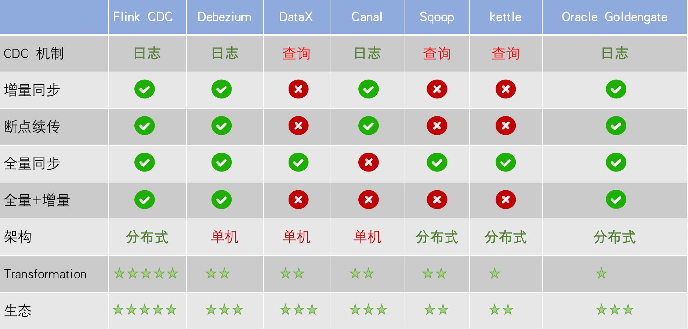

通过图上对比我们可以看到，对于日志查询的方式，增量同步都可以做到，但是基于查询的同步是无法做到增量同步的；在断点续传中，我们的任务有可能消费数据到某个时刻点上面因为各种原因而中断导致任务失败，后面恢复作业的时候我们需要基于这个位移点进行恢复的一个功能。在日志同步功能上；在全量同步上，基于查询或者日志都可以做到，例如MYSQL可以把BINLOG进行重放或者直接整库同步，但是Canal没有做全量支持；在全量+增量的模式上，Flink CDC、Debezium、Oracle Goldengate都支持；在架构角度去看，可以分为单机和分布式，分布式我们不单纯表现在水平扩展上面，在大数据场景会影响比较大，例如我们的数据需要入湖或者入仓，我们的文件系统例如HDFS是分布式架构，在对接上面是否能有比较好的支持，从这个角度上面上看Flink CDC 会支持比较好；数据转换方面，当我们数据进入到CDC 工具时候是否能比较方便的对数据做一些过滤或者清洗，在Flink CDC 上面会比较简单操作，可以通过Flink SQL 去操作这些数据，但是例如像DataX、Debezium需要通过脚本或者模板去做，所以用户在使用的门槛会比较高；生态方面指的是下游的一些数据库或者数据源支持，例如像Flink CDC 下游有丰富的Connector，像写入到TiDB、MySQL、HBase、Kafka等常见的一些组件。

# Flink CDC 项目

先来回顾2个基础概念：Dynamic Table 和 Change Log Stream

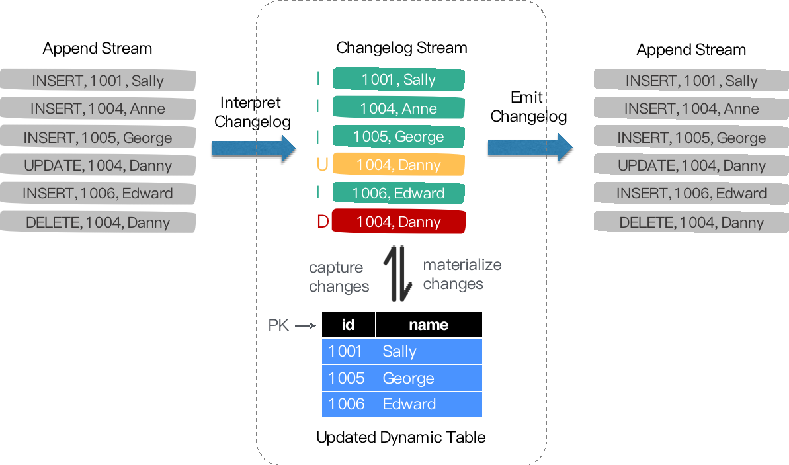

Dynamic Table 就是 Flink 内部定义的表，它是和一条流是等价的，他们两者是可以相互转换的，简单的理解就是：mysql一张表背后其实对应的有binlog，如果你一直对表进行操作更新，binlog也是一直在更新的，相当于数据流和表一直是对应关系的，那么表相当于binlog日志流在某个时刻点物化的结果，那么流就是从这个表一直把这些变更数据进行收集。在Flink中，Change Log Stream 的操作是一一对应的。例如我们表操作从一个算子流向另外一个算子的时候，是以Change Log Stream 的格式发送到下游，当我们数据流向下游时候，都是可以和一张表一一对应，我们可以翻译为一个表，也可以翻译为一个流。

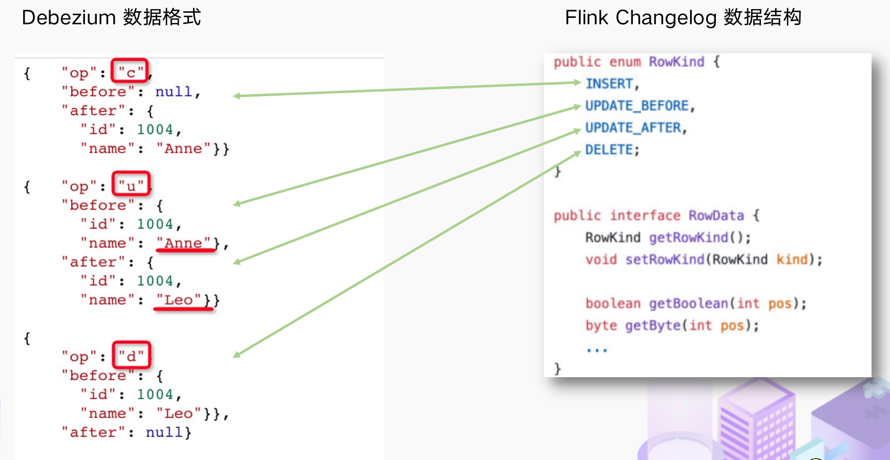

Flink CDC 选择一个底层CDC工具，我们选择了debezium，我们可以做全量+增量的cdc 会比较灵活；RowData 代表了一行的数据，在 RowData 上面会有一个元数据的信息 RowKind，RowKind对应了4种类型进行一一映射 RowKind 里面包括了插入 (INSERT)、更新前 (UPDATE_BEFORE)、更新后 (UPDATE_AFTER)、删除 (DELETE)，这样和数据库里面的 binlog 概念十分类似。通过 Debezium 采集的数据，包含了旧数据 (before)和新数据行 (after) 以及原数据信息 (source)，op 的 u 表示是 update 更新操作标识符（op 字段的值 c，u，d，r 分别对应 create，update，delete，reade），同时还包含一些其他元数据，例如ts_ms 表示同步的时间戳。

## 传统CDC ETL 分析

传统CDC的ETL链路（如下图）可以看到，首先我们必须要有数据采集工具参与，例如国外常用的Debezium，国内常用阿里的Cannal去采集数据库的BINLOG，我们采集到的数据一般输出到消息中间件例如Kafka，然后Flink计算引擎再去消费这一部分数据写入到目的端，例如写入到数据湖或者离线数据仓库

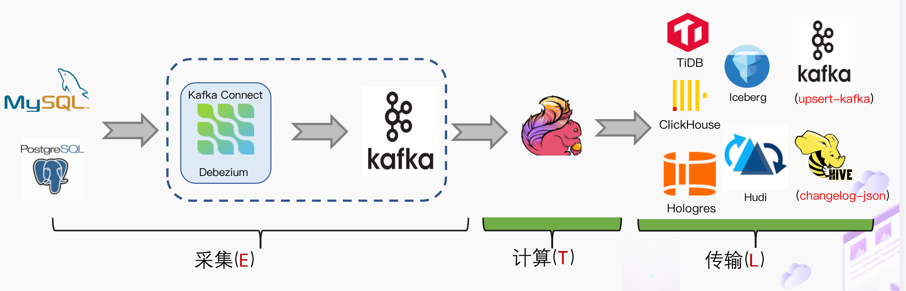

其实我们一直思考是否可以使用Flink CDC去替换前面这2个虚线框内比较大的组件，简化用户的维护成本和使用成本，对于用户而言功能没发生变化，数据传输链路的减少意味着数据时效性的提高。于是就有我们基于Flink CDC 的数据分析流程

## 基于Flink CDC ETL 分析

我们使用了Flink CDC 之后，大大降低用户的使用门槛，我们可以看看下面的DEMO

可以看到我们通过Flink SQL去采集数据写入到TiDB，创建了CDC的产品表和订单表，然后对数据流进行JOIN直接写入到下游数据库，一个SQL就完成了CDC的数据同步。完全的纯SQL实现，使用BI的业务方都可以上手，与此同时可以使用Flink SQL 算子进行清洗、分析、聚合。但是如果是传统的CDC需要进行数据计算转换清洗是比较困难的

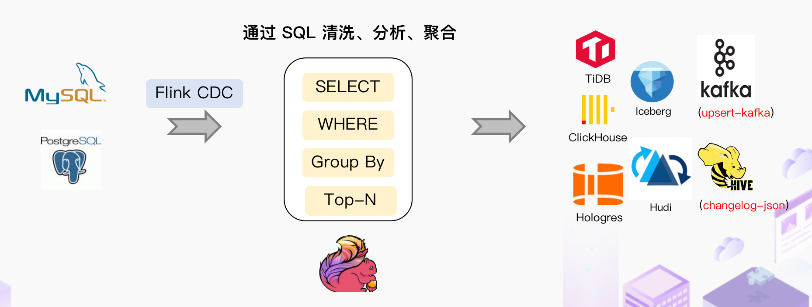

与此同时我们可以通过双流JOIN、维表JOIN、写一些UDTF去实现一些业务方的功能

## Flink CDC 里程碑

2020.07月由云邪第一次提交，是由于个人项目的爱好提交了的第一个commit

2020.07中旬开始支持MySQL-CDC

2020.07末开始支持postgres-cdc

2021.02至今持续发布了多个版本，目前最新版本是1.4.0

项目地址 ：https://github.com/ververica/flink-cdc-connectors

# Flink CDC 2.0 详解 

## Flink CDC 痛点

基于目前版本Flink CDC ，我们通过整理社区的一些反馈，我们可以看到用户普遍有以下痛点：

- 全量+增量同步的过程需要保证所有数据的一致性，因此需要通过加锁保证，但是加锁在数据库层面上是一个十分高危的操作。底层Debezium 在保证数据一致性时，需要对读取的库或表加锁，全局锁可能导致数据库锁住，表级锁会锁住表的读 ，DBA 一般不给锁权限。
- 不支持水平扩展，因为Flink CDC 早期基于Debezium，架构只有1个节点，所以导致了只支持单并发。在全量阶段读取阶段，如果表非常大(亿级别)， 读取时间都在小时级别，对于用户而言，期望能够通过水平资源扩展增加资源去提升作业速度。
- 全量读取阶段不支持 checkpoint：CDC 读取分为两个阶段，全量读取和 增量读取， 目前全量读取阶段是不支持 checkpoint 的，这个就会存在一个问题，当我们同步数据假设需要5个小时，当我们同步了4小时时候作业失败，这时候就需要重新读取数据。

## Debezium 锁分析

Flink CDC 底层封装了 Debezium， Debezium 同步一张表分为两个阶段：

- 全量阶段：查询当前表中所有记录
- 增量阶段：从 binlog 消费变更数据

大部分用户使用的场景都是全量+增量同步，加锁是发生在全量阶段，目的是为了确定全量阶段的初始位点，保证增量 + 全量实现一条不多，一条不少，保证数据一致性。在我们Flink CDC 上面默认使用无锁模式，能够满足大部分场景。从图中我们可以分析全局锁和表锁的一些加锁流程，左边红色线条是锁的生命周期，右面是MySQL开启可重复读事务的生命周期。

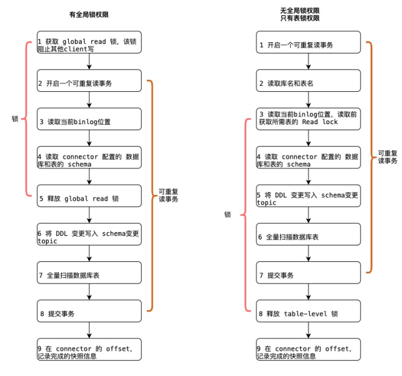

以全局锁为例，首先是获取一个锁，然后再去开启可重复读的事务。这里锁的操作是把当前BINLOG的位置和表的SCEMA读取出来之后，才可以释放一个全局锁。这样做的目的保证你读取的 SCEMA是不变的，获取到你读取一瞬间的表结构。因为后续你有可能对列进行一些操作，例如删除列或者增加列，要保证把这2个正确读取出来之后然后去读取扫描数据，当我们Flink 启动BINLOG Reader 时候是从这个位移点开始读，保证全量数据 + 增量数据的准确性。

表锁是全局锁的阉割版，因为全局锁的权限会比较高，因此部分DBA会允许你使用表锁。表锁锁的时间会更长，因为表锁有个特征：锁提前释放了可重复读的事务默认会提交，这样就会到第六步，全量扫描数据库的表数据，只有全量扫描完成后才能释放锁。

经过上面分析，我们接下来来看看这些锁到底会造成什么样严重的后果

我们通常申请加锁的命令如下 ：

`FLUSH TABLES WITH READ LOCK` 

这条命令需要等待所有正在进行的 update 完成，同时阻止所有新来的 update。与此同时该命令执行成功前必须等待所有正在运行的 select 完成，所以导致了等待执行的 update 会等待的更久。更坏的情况是，当我们申请去加锁的时候，刚刚好有一个慢查询的存在，我们就需要等待这个慢查询完成，这个查询的时间是不固定的，有可能几分钟也有可能几十分钟，这个申请加锁就需要一直等待这么长时间了，除非你有设置TimeOut时间，但是在等的期间，有新的SELECT会给挂起，导致无法查询，这样对于业务方来说就是一种灾难。这样导致了数据库实际上处于不可用状态，即使是新加入的 SELECT 也会被阻止。这是 MySQL Query Cache 机制。

**结论：加锁时间是不确定的，极端情况会锁住数据库导致业务方无法正常访问业务**

## Flink CDC 2.0 设计

通过上面的分析，我们可以知道我们的设计方案，首先要支持无锁，支持水平扩展，支持checkpoint。我们通过基于 FLINK FLIP-27 Source 实现 使得架构更加优雅，与此同时我们为了无锁操作，借鉴了Netflix的 DBlog paper 设计，DBlog paper是它的一个内部数据同步平台，他通过无锁算法来解决加锁问题，下面就给大家介绍一下这个算法。

## 无锁算法

Chunk筛选的算法如下图

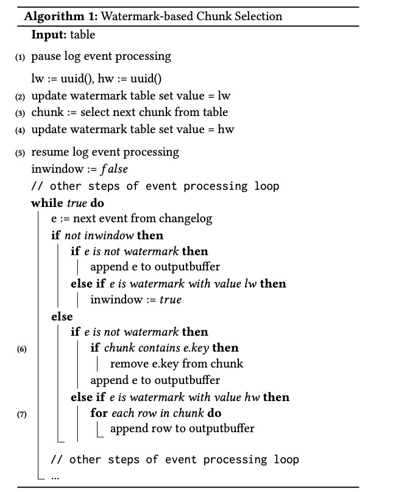

读chunk，当我们划分了chunk后存在全量部分和增量部分，要保证如何把这2个chunk进行一致性的合并，原理如下图

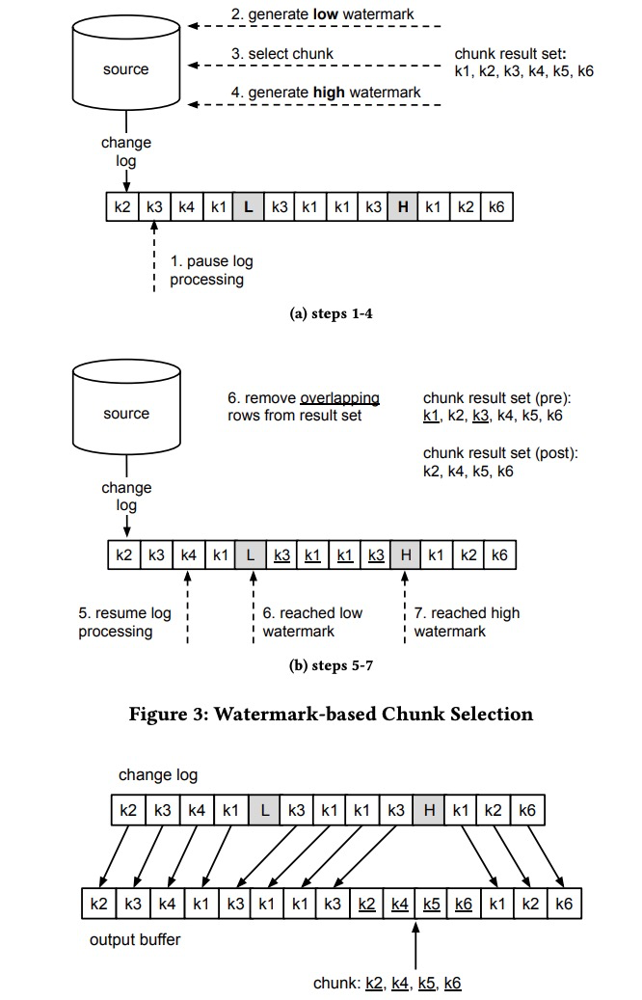

chunk的切分其实和很多数据库的分库分表原理类似，一张表有pk我们可以按照pk对数据进行分片。如下图所示，假设我们每个分片的chunk大小区间为10，然后我们按照这个规则进行切分，我们只需要把这些chunk的区间做成左开右闭或者左闭右开的区间，只要能保证衔接上，保证chunk读取一致性，从而保障整张表数据结构的一致性。

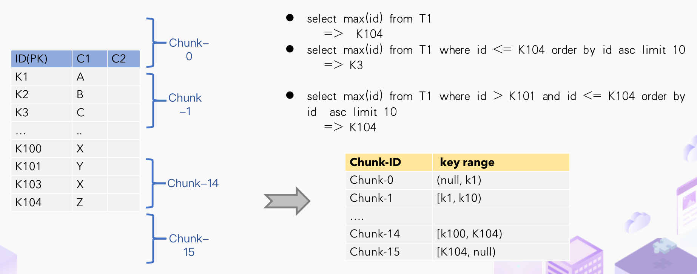

chunk读取方面，针对Flink做了一些改进。Netflix 的 DBlog paper 实现方式是通过在DB维护一张信号表，在BINLOG上面进行打点，对其做Low Position（低位点） 和 High Position （高位点）的标记，在低位点和高位点之间去查询chunk的数据，读取出这一部分chunk数据之后，再去统计这2个位点之间有哪些BINLOG，只有这些BINLOG有在这个区间上面就会和存量的数据进行一个合并。结合Flink的实际需求，我们需要做全量+增量数据的同步。

如下图所示，假设现在数据就是chunk-1，那么chunk是从K1 - K10，直接在这个区间select出来存在window buffer，在select之前保存了一个低位点，select之后保存了一个高位点。消费binlog时候，在图中的-（k2,100）+ （k2,108）表示这条数据从100更新到108，第二条是删除k3，然后继续更新k2为119，第三个是k5数据由原来的77变更为100。我们观察右下角的图片，我们发现出现的key是k3 k5，我们前往window buffer进行标记，对于k1，k4，k6，k7在高位点读取完毕之后，从来没有发生过变化的数据可以直接输出的，对于发送改变过的数据需要保留数据的最终结果，例如k2 最终的结果是119 ，那么我们只需要这个结果，而不需要中间发生过108改变的数据，从而保证全量+增量数据同步的一致性。

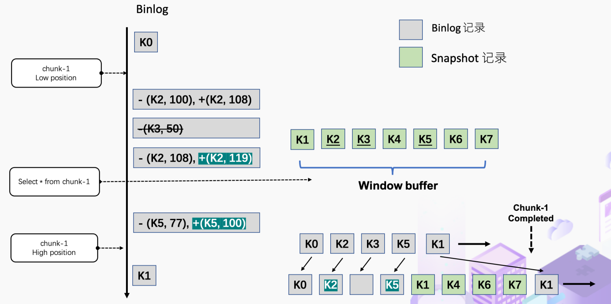

上图保证的是单个chunk的一致性读，但是我们如果有多个表分了很多不同的chunk，这些chunk都分布在不同的地方，那如何保证一致性读呢？我们接下来看看如何基于FLIP-27去实现（如下图）。我们可以看到有SourceEnumerator的组件，这个组件主要用于chunk的划分，划分好的Chunk会提供给下游的SourceReader前去读取，把这些数据进行分发从而实现分布式读snapshot chunk的一个过程。

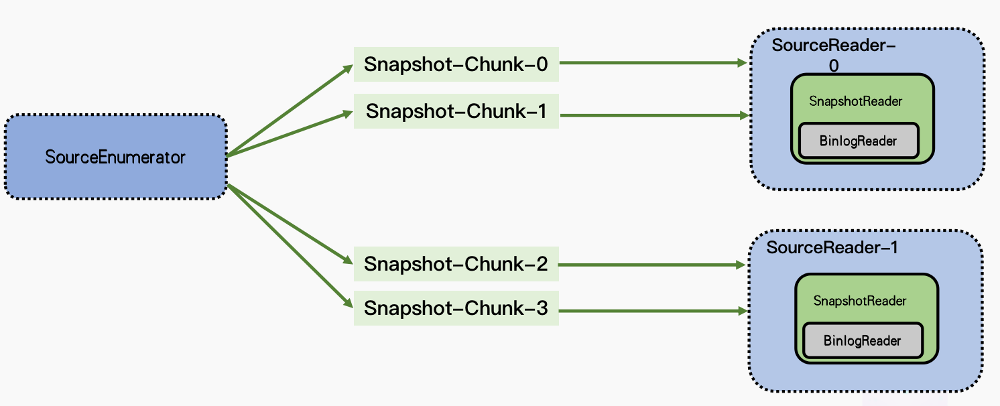

当我们读取完成之后，我们需要有一个汇报的流程（如下图），汇报snapshot chunk读取的一些信息

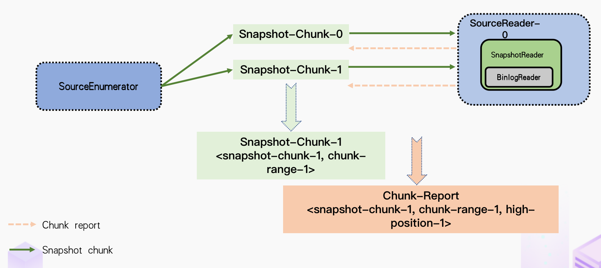

汇报的主要目的是为了我们后续读取BINLOG（如下图）。因为我们支持全量+增量同步，当我们所有全量数据读取完成之后，我们只需要消费增量的BINLOG，把这些BINLOG分配给Source Reader 。例如SourceReader-1读取过snapshot-chunk-2 和 snapshot-chunk-3，它已经知道高位点（High-Position）和数据所在的范围（Chunk-Range），基于这些信息可以判断是否为这个chunk的数据以及是在全量读的阶段还是在增量读取的阶段

下面给大家整理一下整体流程：对于用户而言其实无需过于关注如何切分数据和具体的分片算法，主要是要了解整体的流程。我们通过一个key，有可能是pk或者唯一键值对，我们对这个表进行分片，分片之后分给不同reader去读取数据，先读取全量数据，然后再读取增量数据，在读的过程使用算法进行改进为无锁的结构把之前需要用的的锁给去除掉，这个就是Flink CDC 2.0的一个整体设计

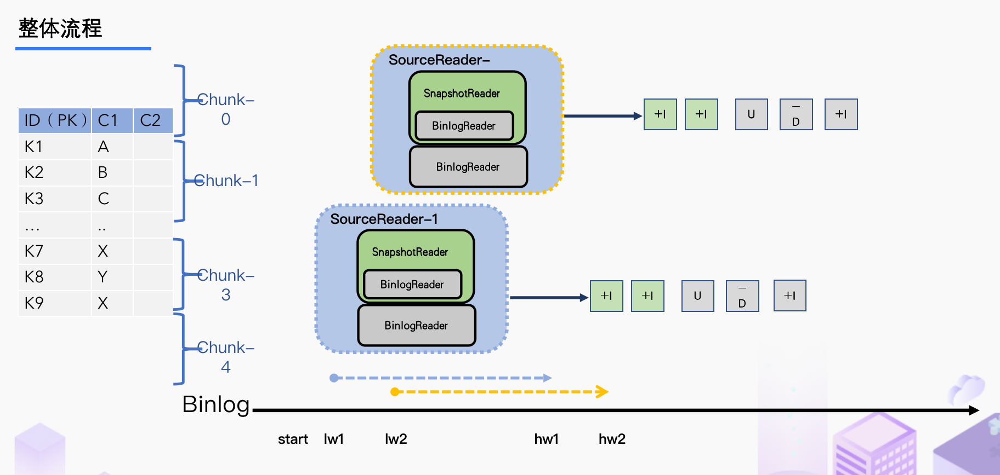

# 未来规划

Flink CDC 2.0设计只是出来第一版，所以在稳定性方面后续会通过一些其他公司开源力量加入继续做深度优化；在**Binlog Merging**这个点上面也存在一定的优化空间，目前版本是你启动了多少个并发，就会启动多少个BINLOG Reader。但是我们可以通过优化一个作业只用一个BINLOG Reader，这样的好处就是对于日志CDC技术都是依赖BINLOG，当我们模拟数据比较多的时候有可能对Master（主库）读取的性能产生一定影响，虽然我们现在一般使用从库，但是我们在技术实现层面还是尽量把影响降到最低。

当我们 Source Reader 对数据读取进行分片的时候，目前方案是一次性全部划分好分片，然后再进行数据读取。这里其实有一个优化点，通过**Lazy Assigning** 进行划分。**Lazy Assigning** 意思是我可以先划分一批，而不是一次性进行全部划分。例如有1W个分片，我们可以先划分1K个分片，而不是一次性全部划分，等用户消耗完后再继续划分分片，避免资源的浪费和节约整体的流程时间。

在Feature支持上面，我们可以实现 **Schema Evolution** 。这个场景是：当我们一张表在同步到一半或者一定时期时候，突然在表中添加了一个字段，然后我们希望后续同步下游的系统时候能够自动加入这个字段； **Watermark Pushdown **通过CDC 的 BINLOG 获取到 一些心跳信息，这些心跳的信息可以作为一个Watermark ，通过这个心跳信息我们可以知道到这个流当前消费的一些进度；支持META数据，分库分表的场景下面有可能需要元数据知道这条数据来源哪个库哪个表，在下游系统入湖入仓上面可以有更多的灵活操作；整库同步：用户的整库同步可以让用户使用Flink CDC更加简便快捷

在生态集成上面我们可以**集成更多 DB 和 Format** 以便用户使用；在入湖层面Hudi和Iceberg写入上面有一定的优化空间，例如在高QPS入湖时候数据分布有比较大的性能影响，这一点是可以通过和生态打通和集成继续优化。

# 总结

今天雪尽老师首先给大家简单的介绍了一下什么是CDC，然后对比目前市面上开源的数据同步工具，对比出它们的优点和缺点，以及目前Flink CDC 如何简化数据同步流程，给用户带来更加丝滑的体验，与此同时，针对目前架构存在的锁问题，通过无锁算法和Flink CDC FLIP 27 进行水平扩展的实现，从而打造出Flink CDC 2.0架构，总结出方案实现的流程和细节，最后给我们带来了CDC2.0之后未来的一些规划，包括入库性能提升、生态集成等多方面进行提升

# 附录

[[1] Flink-CDC-Connector Github](https://github.com/ververica/flink-cdc-connectors)
[[2] Percona  - 深入分析了加锁流程](https://www.percona.com/blog/2014/03/11/introducing-backup-locks-percona-server-2/)
[[3] 无锁并发设计pdf](https://arxiv.org/pdf/2010.12597v1.pdf)
[[4] Flink FLIP 27](https://cwiki.apache.org/confluence/display/FLINK/FLIP-27%3A+Refactor+Source+Interface)
