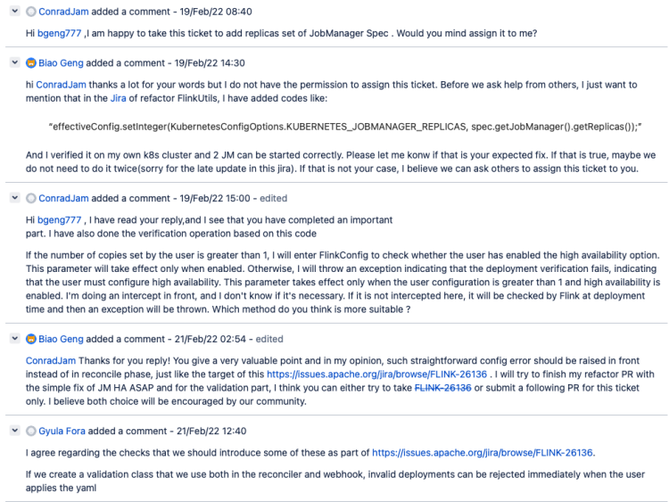
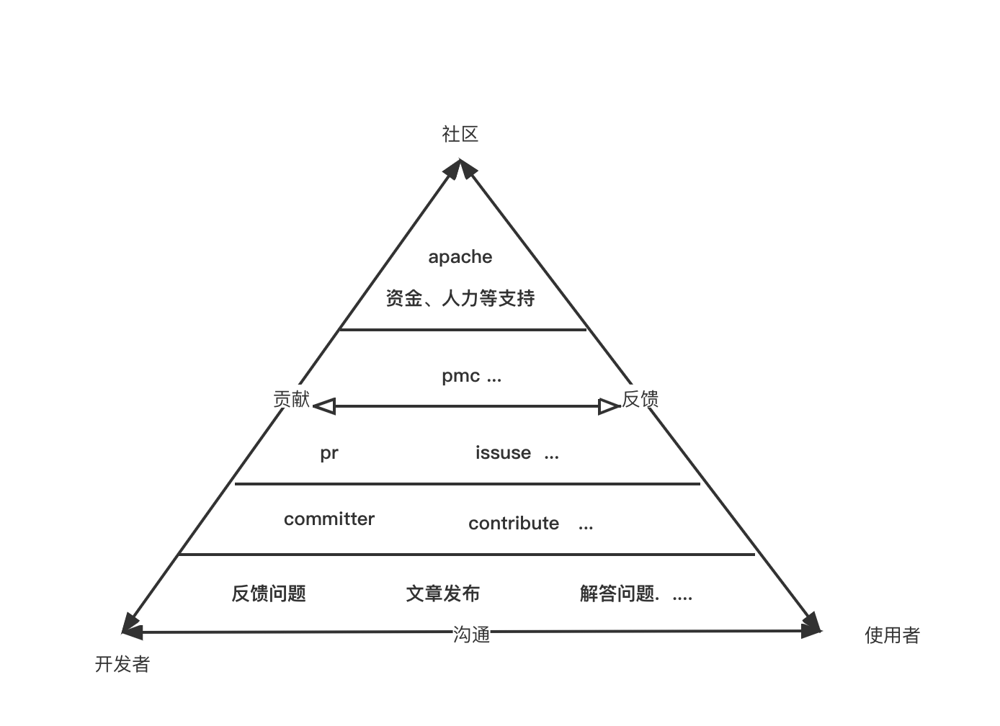
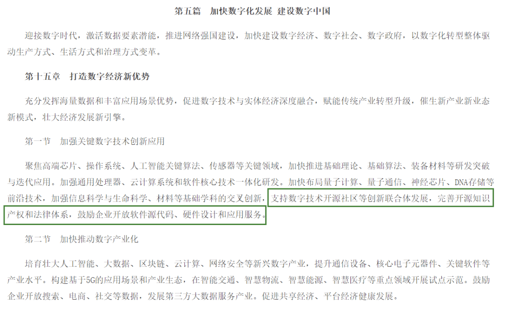

# 个人介绍

主要做一些个人介绍 + 历史以往翻译文章介绍

各位 Flink 社区的伙伴大家好，我是来自 Apache Flink 中文社区的志愿者陈政羽，负责社区日常技术文章稿的翻译和产出。平时的爱好是钻研技术、健身和旅游，目前正在真有趣科技研究中心 - 基础设施研发部，负责基于 K8S 的 Flink 大数据部署作业平台构建与作业研发，为真有趣构建部署、提交作业的一站式 Flink 智能作业平台和、SQL 平台和反外挂平台，欢迎大家多多交流。

# 我与中文社区的成长

在中文社区带给我在开源的影响和工作的影响，以及社区成长之路的介绍

大家在社区看到的很多文章都有我参与的身影，例如《Flink 1.14 新特性预览》、《 Flink CDC 2.0》、《深入解读 Flink SQL 1.13》、《Flink 1.12 资源管理新特性》 等都是经过我翻译视频稿和技术原稿，然后带给大家的。我想把这一年在 Flink 中文开源社区的工作和对于一些开源问题的思考分享给各位，希望能给各位在开源上带来新的启发。

作为 Flink 中文社区早期入坑的志愿者，我还记得我第一篇翻译的文章是《Flink JDBC Connector：Flink与数据库的最佳实践》，徐榜江老师生动的案例和演讲正式带我进入了流式计算的世界。事后我在钉钉中文社区大群看到刚好招聘志愿者翻译这个演讲，于是我就自告奋勇的联系上报名了，其实我是第一次做这样的工作，并没有相关的开源经验，所以也是怀着忐忑和不安的心情去完成的。

首先我能想到的是，这篇文章的产出是给哪些群体看的？因为我们发布文章是给用户看的，而不是写给自己看的，明确了用户群体才能更好的服务对象。于是我询问了相关工作人员文章会发布到哪里，给我的回答是发布到微信公众号 (主要)，各大论坛和阿里云的开发者专栏。这样从中可以了解到：用户群体大部分是不希望花太多时间去回顾线上视频，而是利用碎片时间去了解并学习有关资讯的。所以我在做文章的时候需要去抓住这个用户核心关注点去描述这个事情。

明确了服务对象后，我决定再复盘一次视频，仔细抓住每个细节，其实这个动作现在回过头来看也是非常重要的一点。通常第一次看的时候，可能会知道个大概流程，但总会有一些细节从身边划过而没注意。看到老师们演示的很流畅，那是因为老师们已经对这个东西理解比较透彻了。第二次看的时候，配合后面自己实际动手才会发现里面的一些坑。我们在编写文章的时候，也可以顺手把这些坑提醒给用户，以链接的方式放到文章的末，当用户遇到问题了，可以快速参考定位到解决问题的办法。

但是其实我知道这样是远远不够的，演讲视频或者演讲稿文章的发布，往往都是伴随一些专业名称或者名词，但是对于一些刚刚入门了解 Flink 的用户群体是不友好的，如何把专业名词或者一些抽象概念转化为文章，使用户通俗易懂，也是一件很重要的事情。我会根据文章实际情况去转换这些专业名词，例如在一些版本发布或者重要特性上面，这种需要比较严谨的描述，专业名词会用的比较多；对于实践类的文章，使用一些口语化或者图形化的一些描述，会让用户更加容易了解其运行流程。于此同时，我也会将每次发布的一些文章整理到自己的 github 仓库，方便用户自己进行一些创造或者对认为有歧义的地方提出改进建议。

通过上面的一些分享，相信大家对 Flink 中文社区志愿者的一些工作流程有了一定的了解。通过志愿者这个工作，也让我对开源有了新的认识和认知。通过开源社区结识了许多志同道合的伙伴去贡献 Flink 周边社区的一些配套基础设施，参与进去开发和讨论，接触各个社区都能体会到 Flink 开发者们的热情。从中我也会逐步思考目前国内的一些开源状况和中文社区开源现状。在 Apache 基金会中，‘社区大于代码’ 是 Apache 之道的核心内容，拥有了社区和用户群体，才能使得这款软件走的更稳、更远。开源社区的项目和公司并不是个人项目和 KPI 项目，是需要各位共同探讨、合作的一个项目，这样才有助于社区的多元性。

在今年我也尝试迈出了第一步，首先从一个比较小的一个基础功能点参与ISSUSE的讨论，这是关于K8S Operator JM数量的一个实现，我实现的时候，同时也发现了一些问题：我们在设置JobManager时候，如果数量大于1我们没开启高可用导致部署时候失败，我们是否应该在前置流程做一定的校验，拦截这种操作，避免到了实际部署的时候才出现问题，于是我就把问题抛出去希望大家一起讨论

从图中可以看到，最后讨论结果是我的建议给采纳了。虽然最后这个ISSUSE不是由我来完成（因为过年期间没有来的及时看邮件，痛失机会~~）。但是从中可以看得出，其他常年活跃在Flink的开发者一直鼓励我提交代码并且给出我一些建议。基于这次体验，我也梳理出社区、开发者、使用者这3者在社区的一个金字塔关系（如下图）

上图是我自己简单的从开发者，使用者和社区三个角度，自己的理解做了一个图去分析他们彼此的关系。可以看到我是用一个三角形去描述他们之间的关系，三角形是力学里面比较稳定一个结构，这也是为什么埃及金字塔是用三角形建造的原因。三角形的顶端是社区，下面是社区中的不同角色，包括了开发者，使用者，其中同一个人或许会担任不同的角色和不同的身份。开发者和使用者通过社区进行交流、贡献、反馈，中间包含了代码作者，贡献者等等，通过 pr、issuse 提出问题和贡献代码等。各自都在社区扮演不同的多元角色从而组成一个完整的社区生态，缺少其中任意一环可能都会导致这个金字塔发生倾斜。其中，我认为社区之间的讨论正是让所有人连接起来的桥梁，例如像下图的朋友咨询了一些问题，总会有热心的开发者来解答他的疑问，当下次有人遇到同样的问题时候，他也能反馈给其他人。

现在目前大部分问题汇总其实都在 Flink 官方的 issuse 或前往订阅 **user@flink.apache.org** 或者 **user-zh@flink.apache.org** 的邮件列表，但是中文社区没有一个沉淀问题的地方，大部分是在钉钉群、微信群里面讨论 (如图上所示)，可能解决了某些技术性的问题，但一不留神就会被其他的消息刷过去。其实我们可以借助中文社区网站，开设一个问题板块，用户可以比较自由的探讨一些问题。按照标签进行归类，例如咨询类、招聘类等；技术类的可以引导用户前往 apache 的中文 list 或者英文 list 进行讨论沉淀，这样有助于提高用户解决不同类型的问题体验，也可以对这部分内容进行一个沉淀，提供给用户进行检索，快速解决问题。

社区探讨完后，我们回过头来看看目前国家对待开源是如何定义的。从目前来看，国家对待开源也是持有积极的态度，在国家的十四五纲领就明确指出开源在新时代赋予的新意义。从纲要里提到的 “支持数字技术开源社区等创新联合体发展，完善开源知识产权和法律体系，鼓励企业开放软件源代码、硬件设计和应用服务”，可以看出国家在战略层面对于「开源」的肯定和支持。

放眼国内，2020 和 2021 都是大放异彩的一年，从阿里巴巴收购 Flink 母公司、贡献 Blink 和 Flink 相关特性、国内的开放原子开源基金会挂牌成立、开源流数据公司 StreamNative 等大事件都是值得大家关注的。在这样一个国家大环境下，“十四五” 在法律层面鼓励企业和个人开源，并从底层基础设施方面进行了规划 — 纲要明确指出应完善开源知识产权和法律体系，这足以说明开源是大势所趋。

# 个人期望

针对一些个人目标

通过上面的一些分享，相信大家对 Flink 中文社区志愿者的工作和一些开源工作流程、开源社区运转、国家对开源态度等各方面都有了大概了解了，后续也欢迎各位加入 Flink 社区一起共建开源社区。其实我从开始参与社区志愿者开始，开源的思想种子就已经在萌芽了，这对于我个人对参与开源社区的影响也是比较深远的，这也促进里我后续进一步去了解开源社区，例如 Apache 基金会的运作，开源的各种协议规则，以及参与到类似 Flink 周边生态的一些项目开发。Apache Flink 中文社区今年也规划今年开始，让志愿者更深入的参与到社区来，而不仅仅是整理文章，未来可能还包括参与开发，线下活动组织等，让大家更加深入了解社区运作和参与进来。我也非常感谢2021年社区对我工作的认可，并且评选为社区优秀贡献者。

期望在今年，我能在 Flink 中文社区给大家带来更多优质的内容和产出，于此同时在围绕 Flink 周边开源生态软件有更多活跃贡献的表现，与此同时也期望今年能把我在游戏行业实际生产经验通过一些线下活动会议，也欢迎各位大家持续关注Apache Flink 中文社区网站 和 阿里云开发者社区，了解最新的Flink动态。

**参考链接**

- [0] Apache Flink中文社区：https://flink-learning.org.cn
- [1] 社区志愿稿：https://github.com/czy006/FlinkClub